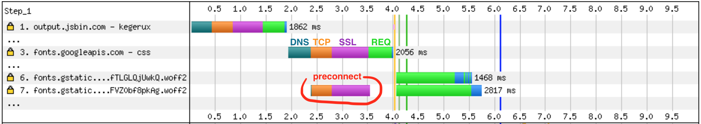

<!-- .slide: data-background="./images/hero_bg.jpg" -->
<h1 class="title dark-background"><span class="translucent">Get in the Fast Lane:</span> Measuring Web Performance</h1>
<h2 class="subtitle">Sia Karamalegos</h2>

-v-

## hi, i'm sia

⚡ 👩🏻‍💻 🇬🇷 🐶 🐺 🎨 📓 ✈️


-v-

## Coding is more fun with friends 🧑🏽‍🤝‍🧑🏻

- 👋 Introduce yourself to your neighbors
- 🍐Pair programming is a great option!
- 💬 Ask lots of questions

Note: Suggest pair programming and give them an opportunity to change seats.

-v-

## Take out a piece of paper...


---

# Topics

<table id="contents-table" style="font-size:0.9em;">
  <tbody>
    <tr>
      <td>[🤷🏼 Intro: Why?](#/2)</td>
      <td>[🏊🏿‍♀️ Deep-Dive: JavaScript in Webpack](#/9)</td>
    </tr>
    <tr>
      <td>[🧪 Test environments](#/3)</td>
      <td>[Smooth UI: Script execution costs](#/10)</td>
    </tr>
    <tr>
      <td>[📈 Metrics](#/4)</td>
      <td>[Real User Monitoring](#/11)</td>
    </tr>
    <tr>
      <td>
        
        [Set up DevTools #LikeABoss](#/5)
      </td>
      <td>[Smooth UI: Other costs](#/12)</td>
    </tr>
    <tr>
      <td>[⌚ Download cost: Latency](#/6)</td>
      <td>[Accessibility debugging](#/13)</td>
    </tr>
    <tr>
      <td>[📸 Download cost: Images](#/7)</td>
      <td>[Closing: Perceived performance](#/14)</td>
    </tr>
    <tr>
      <td>[💰 Download cost: JavaScript](#/8)</td>
      <td></td>
    </tr>
  </tbody>
</table>

---

<!-- .slide: data-background="./images/elevator2.jpg" -->
<h1 class="dark-background">
  <span class="highlighter">Why do elevators have mirrors?</span>
</h1>

Note: Intro

-v-

# Why Should I Care?

-v-

> Pinterest reduced load times by 40% and saw a 15% increase in sign ups.

<small>https://wpostats.com/</small>

-v-

> Starbucks implemented a 2x faster time to interactive resulting in a 65% increase in rewards registrations.

<small>[Chrome Dev Summit 2018](https://www.youtube.com/watch?v=Xryhxi45Q5M&t=1113s&index=6&list=PLNYkxOF6rcIDjlCx1PcphPpmf43aKOAdF )</small>

-v-

> AliExpress reduced load by 36% and saw a 10.5% increase in orders.

<small>https://wpostats.com/</small>

-v-

> Speed is now used as a ranking factor for mobile searches.

<small>https://developers.google.com/web/updates/2018/07/search-ads-speed</small>

Note: In 2016, Doubleclick by Google released a report saying that 53% of mobile sites are abandoned if pages take longer than 3 seconds to load.

---

# 🧪 Test Environments 🧪

-v-

## Exercise Time!

<video autoplay loop>
  <source src="./images/arnold_cats.mp4" type="video/mp4">
  Sorry, your browser doesn't support embedded videos.
</video>

-v-

## Exercise: Flying Blind ✈️

Pick a website you work on. Run it through each of these tools, keeping each open in separate tabs:

1. **Lighthouse** (DevTools audit tab, only check performance)
2. **PageSpeed Insights** [developers.google.com/speed/pagespeed/insights/](https://developers.google.com/speed/pagespeed/insights/)
3. **WebPageTest** [webpagetest.org/easy](http://webpagetest.org/easy)
4. **Test My Site** [testmysite.thinkwithgoogle.com](https://testmysite.thinkwithgoogle.com)
5. **RespImageLint** [ausi.github.io/respimagelint/](https://ausi.github.io/respimagelint/) (requires some set up)

Note: **Discussion**: What do you notice about each? What are the similarities/differences? What do you like/dislike?

-v-

## Testing Environments

<br>

<table class="fixed-two-column" id="invisible-gridlines">
  <thead>
    <tr>
      <th>Lab/Synthetic</th>
      <th>Field/Real User Monitoring (RUM)</th>
    </tr>
  </thead>
  <tbody>
    <tr>
      <td>
        <ul class="plus-minus" style="display:inline;">
          <li class="plus">Controlled environment</li>
          <li class="plus">Predefined network and device settings</li>
          <li class="plus">Reproducible for better performance debugging</li>
          <li class="minus">May not capture real-world bottlenecks</li>
        </ul>
      </td>
      <td>
        <ul class="plus-minus" style="display:inline;">
          <li class="plus">Performance data from **real user page loads** and interactions</li>
          <li class="minus">Limited data and performance debugging capability</li>
      </td>
    </tr>
  </tbody>
</table>


-v-

## Lab/Synthetic Environment Tools

_Emulated CPU and network throttling_

<div id="dev-tool">
  
  <div>Chrome DevTools</div>
</div>
<div id="dev-tool">
  
  <div>Lighthouse</div>
</div>
<div id="dev-tool">
  
  <div>PageSpeed Insights</div>
</div>

Note: DevTools for Network tab (load) and Performance tab (script execution costs)

-v-

> Your laptop is a filthy liar.

<small>Alex Russell, [Progressive Performance talk at Chrome Dev Summit 2016](https://www.youtube.com/watch?v=4bZvq3nodf4)</small>

Note: network and CPU throttling are not representative of real user experiences. mobile CPUs process in a completely different way, and heat management is especially different.

-v-

## Optimize for the device and network your users have

- 2-5x difference in fastest vs slowest phones
- 75% of worldwide mobile connections on 2G or 3G
- Not just developing countries but rural areas or spotty networks like conference wifi
- Use Google Analytics data to profile your users and configure [webpagetest.org](https://www.webpagetest.org/) to reflect them more closely

<small>https://infrequently.org/2017/10/can-you-afford-it-real-world-web-performance-budgets/</small>

Note: Performance budgets at Google are $200 Android phone on a slow 3G network to target 5s initial load and 2s for subsequent. Converts to 130-170kb gzipped.

-v-

## Lab/Synthetic Environment Tools

_Real devices and networks_

<div id="dev-tool">
  
  <div>WebPageTest<br>&nbsp;</div>
</div>

<div id="dev-tool">
  
  <div>DevTools +<br>connected device 📱</div>
</div>

Note: Buy a shitty phone and connect it to your computer for on-device debugging. webpagetest.org/easy has a basic set up - $200 phone, slow 3G?

-v-

## WebPageTest


<small>https://twitter.com/HenriHelvetica/status/1109557588411203584</small>

-v-

## Field/RUM Testing Tools

_Publicly available data_

<div id="dev-tool">
  
  <div>CrUX</div>
</div>

<div id="dev-tool">
  
  <div>PageSpeed Insights</div>
</div>

<div id="dev-tool">
  
  <div>Google BigQuery</div>
</div>

<small>Chrome User Experience (CrUX) data is available in PageSpeed Insights or BigQuery.</small>

-v-

## Field/RUM Testing Tools

_Self-run data sent to your backend or analytics tool_

- Navigation Timing API
- Resource Timing API
- User Timing API for custom timings

<small>
  https://developers.google.com/web/fundamentals/performance/navigation-and-resource-timing/
  <br />https://www.keycdn.com/blog/user-timing/
<small>

-v-

# More tools in the toolbox

-v-

## Test My Site


- Snazzy-looking and gives pretty pdf
- High-level data from WebPageTest and PageSpeed Insights
- Good for the speed scorecard and impact calculator

-v-

## RespImageLint

[RespImageLint](https://github.com/ausi/respimagelint) is a bookmarklet linter for responsive images.


Note: Lighthouse audits also does this better now, but I still like this quick tool and the prescriptive suggestions.

-v-

## Bundle Analyzers

- Several webpack tools exist - check out options on [SurviveJS](https://survivejs.com/webpack/optimizing/build-analysis/)
- One of my favorites: `webpack-bundle-analyzer`


---

# 📈 Metrics 📈

-v-

## ~~Load time~~ Speed Index

How quickly the page contents are visually populated

- Expressed in milliseconds
- Dependent on size of the view port
- Measured in Lighthouse and WebPageTest

> Note: It is particularly useful for comparing experiences of pages against each other (before/after optimizing, my site vs competitor, etc) and should be used in combination with the other metrics (load time, start render, etc) to better understand a site's performance. Historically we have relied on milestone timings to determine how fast or slow web pages were.  The most common of these is the time until the browser reaches the load event for the main document (onload).  The load event is easy to measure both in a lab environment and in the real world.  Unfortunately, it isn't a very good indicator of the actual end-user experience.  As pages grow and load a lot of content that is not visible to the user or off the screen (below the fold) the time to reach the load event is extended even if the user-visible content has long-since rendered. Lighthouse may use a node module called Speedline for this.

<small>https://sites.google.com/a/webpagetest.org/docs/using-webpagetest/metrics/speed-index</small>

-v-

## Time to Interactive

How long it takes a page to become fully interactive

<iframe width="560" height="315" src="https://www.youtube.com/embed/Lx1cYJAVnzA" frameborder="0" allow="autoplay; encrypted-media" allowfullscreen></iframe>

<small>End to End Apps with Polymer by Kevin Schaaf, Polymer Summit 2017</small>

Note: the point at which layout has stabilized, key webfonts are visible, and the main thread is available enough to handle user input within 50ms.

-v-

## Frame Rate


Note: Frame rate or frames per second (fps), is one measure of responsiveness. Modern devices refresh their screens at a rate of 60 fps. Converting that to an individual frame, we theoretically have 16 ms to render. In actuality, the browser needs some of that time, so we should target 10ms per frame. Any more, and the human eye will be able to detect the jank or jitter.

-v-

## RAIL model for performance goals

- **Response**: process events in under 50ms
- **Animation**: produce a frame in 10ms (for 60fps devices)
- **Idle**: maximize idle time (50ms or less)
- **Load**: deliver content and become interactive in under 5 seconds, 2 seconds for subsequent loads*

<small>[Measure Performance with the RAIL Model](https://developers.google.com/web/fundamentals/performance/rail)</small>

Note: R:Complete a transition initiated by user input within 100ms. A: Have 16ms, but browsers need about 6ms to render each frame. I: Maximize idle time to increase the odds that the page responds to user input within 50ms. L:on mid-range mobile devices with slow 3G connections

-v-

## Exercise: Speed Index + TTI

Look at the tools you ran earlier, and write down:

1. The site's speed index
2. The site's time-to-interactive
3. Under what conditions were these run (device, network, emulated/real?
4. Bonus: where might you be able to test performance while using the app (not loading)?

---

# Set up DevTools #LikeABoss


-v-

## Exercise: Set up DevTools #LikeABoss


Note: Go through handout. Drag tabs to reorder.

-v-

## DevTools High-Level Orientation

- **Performance**: script execution costs (flame chart)
- **Network**: download time (waterfall)
- **Audits**: scores performance, PWAs, accessibility, etc (Lighthouse)

Note: Lots of other cool tools exist like local overrides, paint layers, etc.

---

# ⌚ Latency ⌚

Note: Who is brave enough to admit they don't really know what that means?

-v-

<section>
  <h2>latency</h2>
  <p>/ˈlātənsē/</p>
  <ol>
	  <li class="fragment fade-in-then-semi-out">the state of existing but not yet being developed or manifest; concealment.
      <br /><small><em>"tension, and the latency of violence, make the greatest impressions"</em></small></li>
	  <li class="fragment fade-in-then-semi-out">the delay before a transfer of data begins following an instruction for its transfer.
      <br /><small><em>"poor performance due to network latency"</em></small></li>
  </ul>
</section>

-v-

## Latency Exercise #1

1. Perform a Network profile on one of these websites: [espn.com](http://www.espn.com/), [go.com](http://go.com/), [nolalibrary.org/](http://nolalibrary.org/), [spiegel.de/](http://www.spiegel.de/), [grandrapidsohio.com/](http://www.grandrapidsohio.com/)
2. Now, perform a Network profile on one of these websites: [marvel.com/captainmarvel/](https://www.marvel.com/captainmarvel/), [nytimes.com](https://www.nytimes.com/), [clioandcalliope.com](https://www.clioandcalliope.com/), [nola.gov/](https://www.nola.gov/)
3. Compare the two. What do you notice?

-v-

## HTTP/1.1


<small>https://deliciousbrains.com/performance-best-practices-http2/</small>

Note: Starts downloading assets as TCP connections become available

-v-

## HTTP/2


<small>https://deliciousbrains.com/performance-best-practices-http2/</small>

Note: In addition, header compression. HTTP2 server push has not lived up to the promise, but it's still a new area. For the most part, need to use https.

-v-


<small>https://twitter.com/jaffathecake/status/1044121129848377344</small>

-v-

# Fonts


-v-

## Webfonts

<ul class="plus-minus">
  <li class="plus">Hosted on fast and reliable CDNs</li>
  <li class="plus">Can provide optimized variants based on user's browser</li>
   <li class="plus">Opportunity for shared caching on popular fonts</li>
  <li class="minus">Minumum of 2 separate requests</li>
  <li class="minus">Can't use resource hints on the font file</li>
  <li class="minus">Doesn't take advantage of HTTP2 multiplexing</li>
  <li class="minus">No control over FOUT or FOIT</li>
</ul>

-v-

## Exercise Time!

<video autoplay loop playsinline muted>
  <source src="./images/hamster.mp4" type="video/mp4">
  Sorry, your browser doesn't support embedded videos.
</video>

-v-

## Latency Exercise #2

1. Run a network profile on https://turtle-markdown-viewer.netlify.com/.
<!-- TODO: Add a wbt profile -->
<!-- Go to this webpagetest profile: [tinyurl.com/y5bl5ksn](https://tinyurl.com/y5bl5ksn). Click on the waterfall for Run 2 (the median run). -->
2. Focus on the all the CSS and font-related lines.
3. Write down the steps that are happening. What do you notice?

Note: Need to answer question for both Google and local font. Google font is waiting to DL CSS until after current CSS, and local font is waiting until after current CSS though we know we want it.

-v-

## Loading Google Fonts from CSS

```css
@import url('https://fonts.googleapis.com/css?family=Open+Sans:400,700');
```


Note: pause here and ask what else seems wasteful - the connection time to fonts.gstatic.com

-v-

## Loading Google Fonts from HTML

```html
<link href="https://fonts.googleapis.com/css?family=Muli:400"
      rel="stylesheet">
```
<!-- TODO: animate the image to show circle on click and slow bc no preconnect -->


-v-


<small>https://twitter.com/addyosmani/status/743571393174872064?lang=en</small>

Note: pdf version of this is in the replies to this tweet

-v-

## Loading Google Fonts with preconnect to fonts.gstatic.com

```html
<link rel="preconnect" href="https://fonts.gstatic.com/" crossorigin>
<link href="https://fonts.googleapis.com/css?family=Muli:400"
      rel="stylesheet">
```



-v-

## Self-Hosted Fonts

```html
<link as="font" type="font/woff2"
  href="./fonts/muli-v12-latin-regular.woff2" crossorigin>

<link as="font" type="font/woff2"
  href="./fonts/muli-v12-latin-700.woff2" crossorigin>
```


-v-

## Preloading self-hosted fonts

```html
<link rel="preload" as="font" type="font/woff2"
  href="./fonts/muli-v12-latin-regular.woff2" crossorigin>

<link rel="preload" as="font" type="font/woff2"
  href="./fonts/muli-v12-latin-700.woff2" crossorigin>
```


<small>Note that `preload` loads a resource whether used or not. Only preload resources that are needed on a particular page. Don't self-host popular webfonts like Open Sans or Roboto (sabotages caching).</small>

Note: `rel="preload"` tells the browser to declaratively fetch the resource but not “execute” it (our CSS will queue usage). `as="font"` tells the browser what it will be downloading so that it can set an appropriate priority. Without it, the browser would set a default low priority. `type="font/woff2` tells the browser the file type so that it only downloads the resource if it supports that file type. `crossorigin` is required because fonts are fetched using anonymous mode CORS.

-v-

## FOIT


Note: FOIT in action — note the missing navbar text in the filmstrip screenshot (throttled to slow 3G)

-v-

## `font-display`


<small>https://font-display.glitch.me/</small>

Note: add the `font-display` property to the `@font-face` declaration

-v-

## Exercise: Font Latency &amp; Display Optimization

For each step, confirm the expected benefit by running a network profile in DevTools:

1. Move the Google font load to HTML from CSS.
2. Preconnect to fonts.gstatic.com.
3. Preload the local fonts.
4. Fix the FOIT.

-v-

## More Latency and Caching Strategies

- Adjust network download priority with **priority hints**
- Use appropriate **caching headers**
- Use **service workers** for precaching and offline optimization
- **Lazy-load** non-critical assets (below-the-fold assets like images, components in JavaScript, etc.)

<small>[Preload, Prefetch And Priorities in Chrome](https://medium.com/reloading/preload-prefetch-and-priorities-in-chrome-776165961bbf) by Addy Osmani</small>

Note: PRPL pattern - push, render, pre-cache, lazy-load

---

# Optimized, Responsive <br>📸 Images 📸

-v-

## Image Goals

1. Users shouldn't download unnecessary bytes.
2. Our images should look good.

-v-

## Responsive &amp; Optimized Toolbox

- Best file format <!-- .element: class="fragment fade-in-then-semi-out" -->
- Right size and resolution <!-- .element: class="fragment fade-in-then-semi-out" -->
- Art direction <!-- .element: class="fragment fade-in-then-semi-out" -->
- Lazy loading <!-- .element: class="fragment fade-in-then-semi-out" -->

-v-

# 💾  File Format  💾

-v-

> Choosing the right image format... can be far more important than any flashy new “responsive image” technique.

<small>Mat Marquis, [Image Performance](https://abookapart.com/products/image-performance)</small>

Note: Responsive Issues Community Group (RICG) chair. Getting the right image format is more important than any responsive image technique.

-v-

## Raster vs Vector


<small>https://commons.wikimedia.org/wiki/File:Bitmap_VS_SVG.svg</small>

Note: Raster images contain a set of data about a 2D grid of pixels. Vectors are a system of coordinates and "vectors" than can be redrawn at any size. Rasters are good for photo-realism. Raster file formats are really just different compression methods.

-v-

## File Format Options

- `svg` (vector) - best for limited colors and sharp lines (e.g., logos)
- `gif` (lossy) - fun but terrible. Use svg or video instead.
- `png` (lossless) - best for photo-realistic with transparency.
- `jpg` (lossy) - much better compression based on hue
- `webp` (lossy or lossless) - best of both `png` and `jpg` with smaller file sizes

Note: Raster file formats are really just different compression methods. **SVG**: Can style and animate with CSS or make basic edits in XML. **GIF**: huge file sizes for animation, use video instead. svg or jpg are better for stills. Twitter converts GIF to video. **Lossless compression** - like using ZIP for a file but all the data is still saved. **PNG**: Use jpg if don't need transparency. **JPG**: much better compression algos.

-v-

# 📺 Size &amp; Resolution 📺

-v-

## `srcset`

- Defines a set of images and the natural size of each image
- Always include a **base src** attribute for older browsers.
- The browser chooses the best image to download based on assumed display width of `100vw` and the user's screen resolution.

**`srcset` files are candidates, not commands.**

```html

```

Note: `srcset` is an attribute for ``. Width is in pixels even though is says `w`. Format is filename, space, actual image width in pixels. Alternatively, use x-descriptors.

-v-

## `sizes`

- Defines a set of media conditions and sizes intended for display of the image
- Leave out the media condition for the last one (serves as default for no matches)
- **Order matters! First match is used.**
- Browser chooses the best image to load based on matching display width and user's screen resolution.
- Add analogous CSS

```html

```

Note: Format is [media condition][space][display width]. Once again, these are candidates, not commands. We are letting the browser choose which file to use ultimately.

-v-

## Demystifying Resolution

- **DPR (device pixel ratio)** = viewport CSS pixels/actual screen resolution
- **In layman's terms**: on a 2x screen, a displayed image width of 100px needs a 200px file/natural width image to look good.
- **Example**: If the viewport is 320px, the pixel ratio for the medium image would be 800/320 = 2.5x. Thus, the browser would choose the medium image for a Retina (2x) display:

```html

```

Note: `srcset` can accept DPR instead of widths, though I find this more confusing.

-v-

## Image Exercise 1

1. **Analyze**
  - Write down how big our initial load is now.
  - Inspect an `` then hover on filename to see displayed and natural sizes.
  - Run the RespImageLint bookmarklet to get suggestions.
2. **Optimize**
  - Replace the large `png` images with `jpg` ones.
  - Use `srcset` and `sizes` to provide options for screens with DPRs of 1 and 2 (optional: 4).
2. **Debug**
  - Find your screen DPR: `window.devicePixelRatio`.
  - Discover which file is being used: Inspect > Properties > `img` > `currentSrc`. Start with a small screen size, then observe how this changes as you increase.

Note: Demo pups? Mention how behavior is different in different browsers.

-v-

# 🎨 Art Direction 🎨


Note: (1) Art direction is a technique for drawing attention to the most important parts, or targeting specific features of an image, even when it’s viewed on different devices or platforms. (2) So how do we do art direction?

-v-

## `<picture>`

- Provide multiple images based on device size, resolution, orientation, and more.
- Use `media` attribute for viewport spec. First match is used.
- Always provide `` last for no match or browsers that do not support `<picture>` and `<source>`

```html
<picture>
  <source media="(min-width: 800px)"
          srcset="wide_800.jpg 800w,
                  wide_1600.jpg 1600w">
  <source media="(min-width: 400px)"
          srcset="narrow_400.jpg 400w,
                  narrow_800.jpg 800w">
  
</picture>
```

Note: (1) In this `picture` tag, we have 2 sources and an img. Older browsers simply ignore the picture and source tags and use the img tag. (2) The video tag also works this way and can have multiple `source` tags

-v-

## Bleeding-Edge File Formats

- Use `<picture>` for new file formats like `webp`!
- The browser uses the first compatible file type listed.
- The `` source should be a fallback file format for browsers that don't support the previous formats listed.

```html
<picture>
  <source type="image/webp" srcset="pug_life.webp">
  
</picture>
```

-v-

## `webp`, `srcset`, &amp; `sizes`, oh my!

```html
<picture>
  <source srcset="./images/sofa_pug_400.webp 400w,
                  ./images/sofa_pug_800.webp 800w"
          type="image/webp" />
  
</picture>
```

-v-

## Image Exercise 2

1. Provide `webp` formats with `jpg` fallbacks, full source sets, and sizes for one picture (see `webp` files provided).
2. (Optional) Install `cwebp` and create `webp` versions of the other images, then update them as well. See next slide for getting started...

<!-- TODO: provide install and sample commands -->
<small>[developers.google.com/speed/webp/docs/cwebp](https://developers.google.com/speed/webp/docs/cwebp)

-v-

## `cwebp`

- Install:
  - Mac `brew install cwebp`, Windows `choco install webp`, Red Hat `yum install libwebp-tools`, Node-based `npm i -g cwebp-bin`
- Use:
  - Convert `source.png` to a lossy webp file `output.webp` with a quality of 75 (0-100): `cwebp -q 75 source.png -o output.webp`
  - Convert `source.png` to a lossless webp file `output.webp`: `cwebp -lossless source.png -o output.webp`
  - For lossless, control compression with `-z` (0-9 with 9 being highest compression but also longest encoding)

<small>[developers.google.com/speed/webp/docs/cwebp](https://developers.google.com/speed/webp/docs/cwebp)

-v-

## Do I really have to write all this markup?

Nope. Some (not all) tooling options:

- Simple `` and server selects best image to respond with
- Paid cloud-based services like [Cloudinary](https://cloudinary.com)
- Build tools like various webpack loaders

Note: (1) Many people have their server hijack the request and serve the best image to minimize markup. Could also use a serverless function. (2) Cost money. (3) So many options - both create your srcset code and process the images

-v-

# Lazy Loading Images

-v-

## I can't wait for the future

<small>Native lazy-loading for `` and `<iframe>` hopefully in Chrome ~75</small>

 examples" class="nooutline" width="60%">

<small>[addyosmani.com/blog/lazy-loading/](https://addyosmani.com/blog/lazy-loading/)</small>

-v-

## Image Exercise 3: Lazy Loading for Today &trade;

In the meantime, let's install `yall` in our project:

```bash
npm i yall --save
```

```js
document.addEventListener("DOMContentLoaded", yall);
```

```html
<!-- An src-only  element example -->

```

How big is our initial load now?

<small>See repo for all details and for `IntersectionObserver` polyfill: [github.com/malchata/yall.js](https://github.com/malchata/yall.js)</small>

---

# Download cost:<br>💰 JavaScript 💰

Note: Are all assets created equally?

-v-

## JavaScript: Your Most Expensive Asset

<iframe width="990.6990950226244" height="482" seamless frameborder="0" scrolling="no" src="https://docs.google.com/spreadsheets/d/e/2PACX-1vTlTFx0oq6iA73uPBd4X1kaF05-R82KHMMGF7wzgvPTvdgMsPyjKZk5fAPOmPhc33g_Zoul7EsB2Cg9/pubchart?oid=1765333686&amp;format=image"></iframe>

<small>Adapted from [The Cost of JavaScript](https://medium.com/dev-channel/the-cost-of-javascript-84009f51e99e) by Addy Osmani</small>

-v-

## TL;DR: Ship less code

- less code = less load + less parse/compile
- holy grail = prioritize only what's needed in view

-v-

## Exercise: JS DevTools, Part 1

1. On the Network tab, turn off any throttling so this doesn't take forever. 😂
2. Run a Network profile on one of the following: [cnn.com](https://www.cnn.com/), [bbc.com](https://www.bbc.com/), [nytimes.com](https://www.nytimes.com/), or any major news site.
3. What do you notice?

-v-

## Exercise: JS DevTools, Part 2

1. Type **cmd + shift + p**, then start typing "third" to find and turn on: `Appearance: Show third party badges`.
2. Now, what do you notice?

-v-

## Exercise: JS DevTools, Part 3: 3rd-party scripts analysis

1. Run a Performance profile on reload, without throttling.
2. Check out the Summary pane for full JS execution time.
3. Click on the Bottom-up pane. Play with the group by feature, especially domain and product.
4. Which 3rd-party scripts are the worst offenders?

-v-

## Exercise: JS DevTools, Part 4: 3rd-party scripts analysis

1. Go back to the Network tab, right-click on one or more of your worst offenders, and select "Block request domain".
2. Go back to the Performance tab and re-run the profile on reload.
3. Use the timeline sessions list to switch back and forth and compare the results.
4. **Discussion**: How can we use this info to improve performance?

Note: 3rd party scripts can be your biggest JS offender. Know how to find and measure them, and use that info to make better decisions within your organization or to pressure your vendors to write more efficient scripts.

-v-

## Exercise: Bundle Analysis, Part 1

1. Clone this webpack workshop repo: [tinyurl.com/webpack-workshop](https://tinyurl.com/webpack-workshop).
2. `cd` into the directory and run `npm install`.
3. Note that webpack-bundle-analyzer is installed (see webpack.config.js).
4. Run `npm run build` to run the production build which currently also triggers webpack-bundle-analyzer.
5. What do you notice about our JavaScript bundle?

-v-

## Module Imports

```javascript
// Big
import _ from 'lodash';
_.isEmpty({});

// Big
import {isEmpty} from 'lodash';
isEmpty({});

// Little
import isEmpty from 'lodash/isEmpty';
isEmpty({})

// Big
import moment from 'moment';

// Little
import addMinutes from 'date-fns/addMinutes';
```

<small>Use Moment? Try [date-fns](https://date-fns.org/) instead.</small>

-v-

## Exercise: Bundle Analysis, Part 2

1. Find where Lodash is used in the project.
2. Update the import to only import the function(s) needed.
3. Re-run `npm run build` to see if it improved.
4. Hover over the various blocks. How did the sizes change for the whole bundle and for just Lodash?

-v-

## Optimizing Time to Interactive

- **Analyze your loads and bundles! Don't over-optimize!**
- **Only ship what's immediately needed** - use code splitting, pre-caching, and deferred or lazy loading.
- **Minify** to speed up both download and parse/compile.
- **Compress** with gzip or brotli.
- **Remove unused code** with tree shaking and using module imports effectively.
- Set up **performance budgets** to prevent performance creep.

<small>https://webpack.js.org/configuration/performance/</small>

-v-

## Client vs Server vs Progressive Rendering

<iframe width="749.4849246231156" height="463.3975" seamless frameborder="0" scrolling="no" src="https://docs.google.com/spreadsheets/d/e/2PACX-1vTlTFx0oq6iA73uPBd4X1kaF05-R82KHMMGF7wzgvPTvdgMsPyjKZk5fAPOmPhc33g_Zoul7EsB2Cg9/pubchart?oid=882710936&amp;format=interactive"></iframe>

<small>Inspired by https://twitter.com/aerotwist/status/729712502943174657</small>

-v-

## Client vs Server vs Progressive Rendering

<iframe width="749.4849246231156" height="463.3975" seamless frameborder="0" scrolling="no" src="https://docs.google.com/spreadsheets/d/e/2PACX-1vTlTFx0oq6iA73uPBd4X1kaF05-R82KHMMGF7wzgvPTvdgMsPyjKZk5fAPOmPhc33g_Zoul7EsB2Cg9/pubchart?oid=2121502741&amp;format=interactive"></iframe>

<small>Inspired by https://twitter.com/aerotwist/status/729712502943174657</small>

-v-

## Client vs Server vs Progressive Rendering

<iframe width="749.4849246231156" height="463.3975" seamless frameborder="0" scrolling="no" src="https://docs.google.com/spreadsheets/d/e/2PACX-1vTlTFx0oq6iA73uPBd4X1kaF05-R82KHMMGF7wzgvPTvdgMsPyjKZk5fAPOmPhc33g_Zoul7EsB2Cg9/pubchart?oid=1240736189&amp;format=interactive"></iframe>

<small>Inspired by https://twitter.com/aerotwist/status/729712502943174657</small>

-v-

## Client vs Server vs Progressive Rendering

<iframe width="749.4849246231156" height="463.3975" seamless frameborder="0" scrolling="no" src="https://docs.google.com/spreadsheets/d/e/2PACX-1vTlTFx0oq6iA73uPBd4X1kaF05-R82KHMMGF7wzgvPTvdgMsPyjKZk5fAPOmPhc33g_Zoul7EsB2Cg9/pubchart?oid=1546390226&amp;format=interactive"></iframe>

<small>Inspired by https://twitter.com/aerotwist/status/729712502943174657</small>

Note: Paul Lewis coined the term "uncanny valley". Optimizing for content visibility instead of time to interactivity can leave users more frustrated.

-v-

## Client vs Server vs Progressive Rendering

<iframe width="749.4849246231156" height="463.3975" seamless frameborder="0" scrolling="no" src="https://docs.google.com/spreadsheets/d/e/2PACX-1vTlTFx0oq6iA73uPBd4X1kaF05-R82KHMMGF7wzgvPTvdgMsPyjKZk5fAPOmPhc33g_Zoul7EsB2Cg9/pubchart?oid=1471728610&amp;format=interactive"></iframe>

<small>Inspired by https://twitter.com/aerotwist/status/729712502943174657</small>

Note: PRPL - push minimal code for initial route, render route and get interactive, pre-cache using service workers, and lazy-load async routes. Progressive bootstrapping - Send down a minimally functional page (composed of just the HTML/JS/CSS needed for the current route). As more resources arrive, the app can lazy-load and unlock more features.

-v-

## The Cost of Unnecessary Transpiling

```html
<!-- Browsers with ES module support load this file. -->
<script type="module" src="main.mjs"></script>

<!-- Older browsers load this file (and module-supporting -->
<!-- browsers know *not* to load this file). -->
<script nomodule src="main.es5.js"></script>
```

-v-

## The Cost of Unnecessary Transpiling

<table>
  <thead>
    <tr>
      <th>Version</th>
      <th>Size <br />(minified)</th>
      <th>Size <br />(minified + gzipped)</th>
      <th>Parse/eval time (avg)</th>
    </tr>
  </thead>
  <tbody>
    <tr>
      <td>ES2015+</td>
      <td>80K</td>
      <td><strong>21K</strong></td>
      <td><strong>172ms</strong></td>
    </tr>
    <tr>
      <td>ES5</td>
      <td>175K</td>
      <td><strong>43K</strong></td>
      <td><strong>367ms</strong></td>
    </tr>
  </tbody>
</table>

<small>https://philipwalton.com/articles/deploying-es2015-code-in-production-today/</small>

Note: We transpile and polyfill most code, but most users are on modern browsers. So why are we shippping Unnecessary code? What's the impact?  Webpack can create 2 bundles for you - transpiled to ES5 and not-transpiled ES2015+. These are the results from a small blog app - remember since JS is most expensive asset this affects not just download but parse and compile time. <strong>Bigger apps mean bigger gains</strong>. No time to go through how, but this article goes through the steps. (test using script type=module, set up separate webpack config and need to include modules

---

# 🏊🏿‍♀️ Deep-Dive: 🏊🏿‍♀️<br>JavaScript in Webpack

---

# Smooth UI: Script execution costs

-v-

## Exercise: Finding long-running JS

1. Clone https://github.com/benweet/stackedit.
2. cd into the repo and run `npm install`.
3. Run `npm start`.
4. Navigate to the app in localhost, and select some text in the editor.
5. Go to the Performance tab, and check screenshots.
6. In quick succession, hit record, click one of the transformations in the app's navbar, then stop recording.
7. Where is the long-running JS? Can you tell from the screenshots what is happening?

-v-

## We Do: Frame data and Flame charts

- How many frames per second is one of the long frames running?
- Can you identify a source for long-running JS (file and line number)?
- How might we confirm this or even see real-user data for this long-running JS?

---

<h1 style="font-size:2.3em;"> 🍹 Real User Monitoring 🍹</h1>

-v-

> Real user monitoring data is used to determine the actual service-level quality delivered to end-users and to detect errors or slowdowns on web sites.

<small>[Wikipedia](https://en.wikipedia.org/wiki/Real_user_monitoring)</small>

Note: Great for things like finding out your CDN provider doesn't serve a particular location well.

-v-

## RUM Using JavaScript APIs

- **Navigation Timing API** collects performance metrics for HTML documents
- **Resource Timing API** collects performance metrics for document-dependent resources (css, scripts, images, etc.)
- **User Timing API** for custom timings

<small>
  https://developers.google.com/web/fundamentals/performance/navigation-and-resource-timing/
  <br />https://www.keycdn.com/blog/user-timing/
<small>

-v-

## Navigation and Resource Timing Usage

Navigation and Resource Timing (and related APIs) store performance entries in a performance entry buffer:

```javascript
// Get ALL the timings
performance.getEntries()

// Navigation Timing API entries
performance.getEntriesByType('navigation')

// Resource Timing API entries
performance.getEntriesByType('resource')

// Get timing data for an important hero image
var heroImageTime = performance.getEntriesByName("https://somesite.com/images/hero-image.jpg")

// Get timing data for an important hero image
var allTheTimings = performance.getEntries({
  // Get entries by name
  "name": "https://somesite.com/images/hero-image.jpg",
  // Get entries by type
  "entryType": "resource",
  // Get entries by their initiatorType value:
  "initiatorType": "img"
})
```

-v-

## Example Timing Data

```javascript
{
  "connectEnd": 152.20000001136214,
  "connectStart": 85.00000007916242,
  "decodedBodySize": 1270,
  "domComplete": 377.90000007953495,
  "domContentLoadedEventEnd": 236.4000000525266,
  "domContentLoadedEventStart": 236.4000000525266,
  "domInteractive": 236.2999999895692,
  "domainLookupEnd": 85.00000007916242,
  "domainLookupStart": 64.4000000320375,
  "duration": 377.90000007953495,
  "encodedBodySize": 606,
  "entryType": "navigation",
  "fetchStart": 61.600000015459955,
  "initiatorType": "navigation",
  "loadEventEnd": 377.90000007953495,
  "loadEventStart": 377.90000007953495,
  "name": "https://example.com/",
  "nextHopProtocol": "h2",
  "redirectCount": 0,
  "redirectEnd": 0,
  "redirectStart": 0,
  "requestStart": 152.50000008381903,
  "responseEnd": 197.80000008177012,
  "responseStart": 170.00000004190952,
  "secureConnectionStart": 105.80000001937151,
  "startTime": 0,
  "transferSize": 789,
  "type": "navigate",
  "unloadEventEnd": 0,
  "unloadEventStart": 0,
  "workerStart": 0
}
```

Note: Times are in milliseconds

-v-

## Resource and Navigation Timings are great for measuring...

- DNS lookup time
- Connection and TLS negotiation times
- Cache seek plus response time
- Service worker plus response time
- Request plus response time
- Download time
- Time to first byte
- Document unloading
- Redirects
- Timing for a specific resource (e.g., image)
- Stuff to the millisecond

-v-

## User Timing API

```javascript
// Add a timing called 'start'
performance.mark('start')

// Add a timing called 'end'
performance.mark('end')

// Measure the difference between 'start' and 'end'
// and call it 'difference'
performance.measure('difference', 'start', 'end')

// Clear a mark or a measure
performance.clearMarks('start')
performance.clearMeasures('difference')

// User Timing entries
performance.getEntriesByType('mark')
performance.getEntriesByType('measure')
```

<small>https://developer.mozilla.org/en-US/docs/Web/API/User_Timing_API</small>

-v-

## User Timing Sample Data

```javascript
{
  "duration": 0,
  "entryType": "mark",
  "name": "start",
  "startTime": 1719086.7,
}
```

```javascript
{
  "duration": 14219.5
  "entryType": "measure"
  "name": "difference"
  "startTime": 1719086.7
}
```

-v-

## User Timings are great for measuring...

- Specific events like:
  - Stylesheets done blocking
  - Hero image finished loading and blocking
  - Scripts done blocking
  - Fonts loaded
  - Specific text displayed (be careful of render-blocking fonts)
  - Suspected piece of long-running JavaScript
- Stuff to the microsecond

-v-

## Exercise

Use the user-timing API to add performance marks and measures for one piece of long-running JS in the last exercise.

-v-

## User Timing is Available for 90+% of Users

<small>Resource timing is similar, and Navigation timing is around 93%.</small>


<small>https://caniuse.com/#feat=user-timing</small>

-v-

## Use a check to avoid weirdness

```javascript
if (performance.getEntriesByType("navigation").length > 0) {
  // Yay, we have Navigation Timing stuff!
}
```

-v-

## Should I send all my perf data?

-v-

## No!

**Measuring performance shouldn't result in lower performance.**

Be selective in the data you send. Don't block the main thread.

Note: What is the most critical element on the page that tells the user it is finished loading? E.g. maybe title for a blog. How does the user interact with the page? Measure those key timings. Maybe only do it temporarily to profile your app. You can always dive deeper if you discover a problem.

-v-

## Option 1: `requestIdleCallback()`

- Queues a function to be called during a browser's idle periods.
- Use the timeout option to make sure it eventually runs.
- Minuses:
  - Only available in Firefox, Chrome, and Android-related browsers (only 72% worldwide).
  - User could navigate away or close the window before it runs.

<small>https://developer.mozilla.org/en-US/docs/Web/API/Window/requestIdleCallback</small>

-v-

## Option 2: `navigator.sendBeacon()` on `visibilityChange`

- Allows us to send an asynchronous request without delaying the next action (e.g., navigation).
- Executes when the User Agent has the opportunity to do so.
- Doesn't wait for a response.
- Minuses:
  - Available in more browsers (86% worldwide), but not all.
  - User agents restrict how much data may be sent, and could reject a larger request.

<small>https://developer.mozilla.org/en-US/docs/Web/API/Navigator/sendBeacon</small>

-v-

## `navigator.sendBeacon()` in action

```javascript
window.addEventListener("visibilitychange", function() {
  // Caution: If you have a _lot_ of performance entries, don't send _everything_ via getEntries. This is just an example.
  let rumData = new FormData();
  rumData.append("entries", JSON.stringify(performance.getEntries()));

  // Check for sendBeacon support:
  if("sendBeacon" in navigator) {
    // Queue beacon request and inspect for failure
    if(navigator.sendBeacon(endpoint, rumData)) {
      // sendBeacon worked! We're good!
    } else {
      // sendBeacon failed! Use XHR or fetch instead
    }
  } else {
    // sendBeacon not available! Use XHR or fetch instead
  }
}, false);
```

---

# Smooth UI: Other costs

-v-

Check out Umar Hansa's [Modern DevTools](https://moderndevtools.com/) course to learn even more like:

- Frames and animation
- Layer rendering
- Paint costs
- Node debugging

---

# Accessibility debugging

-v-

## Accessibility debugging

- Contrast checks
- Accessibility pane
- Audits

<small>Check out Umar Hansa's free lesson here: https://www.youtube.com/watch?v=xWPMfcjhts8</small>

Note: Inspect text, click on color box, unfurl contrast info. up/down arrow icon in color blocks area opens palette - can choose page colors and test alternates. Do background color picker. Accessibility tree in Accessibility pane.

---

# Perceived Performance

Note: Using psychology to make an app feel faster than it actually is

-v-

<!-- .slide: data-background="./images/baggage_claim.jpg" -->
<h1 class="dark-background">
  <span class="highlighter">Houston's Baggage Claim Complaints</span>
</h1>

<small>http://www.nytimes.com/2012/08/19/opinion/sunday/why-waiting-in-line-is-torture.html</small>

Note: “Often the psychology of queuing is more important than the statistics of the wait itself,” notes the M.I.T. operations researcher Richard Larson. Occupied time (walking to baggage claim) feels shorter than unoccupied time (standing at the carousel).

---

> Are you better off making the site load faster or ensuring that users complete their tasks?

<small>Christine Perfetti, [The Truth About Download Time](https://articles.uie.com/download_time/) 2006</small>

---

<!-- .slide: data-background="./images/hero_bg.jpg" -->
<h1 class="title dark-background">Thanks!</h1>
Slides, resources, and more at <a href="https://bit.ly/siaspeaks" class="dark-background">bit.ly/siaspeaks</a>
