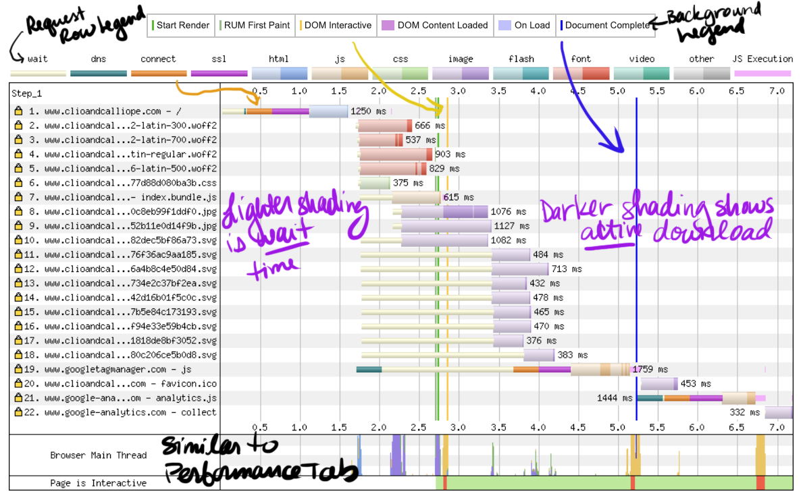
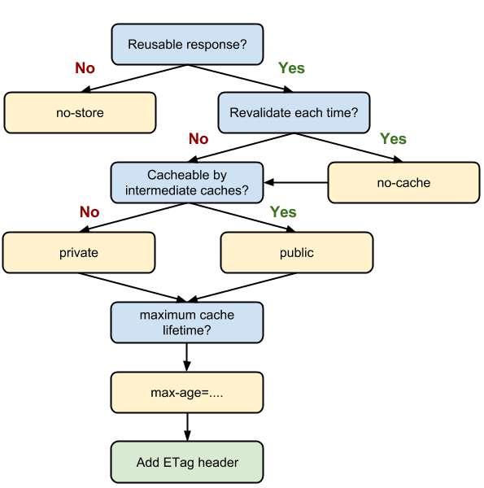
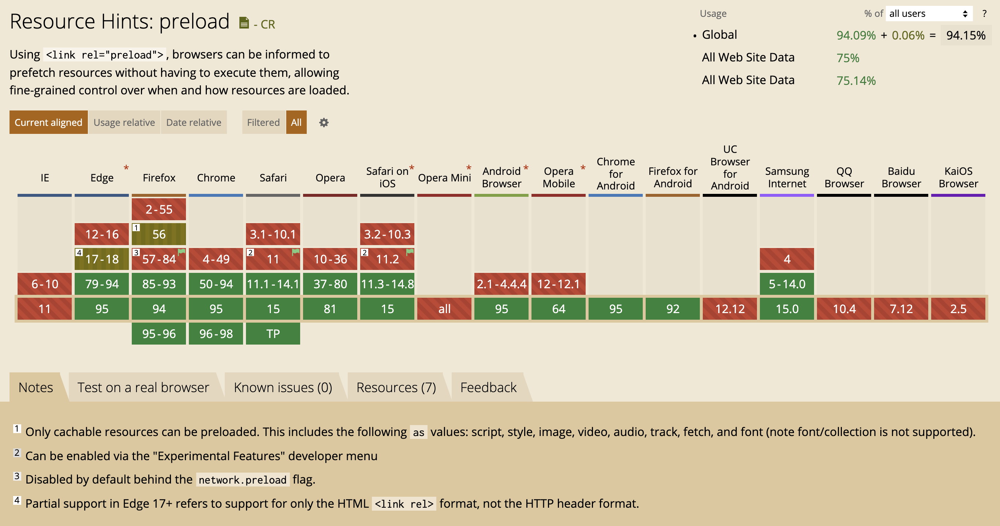
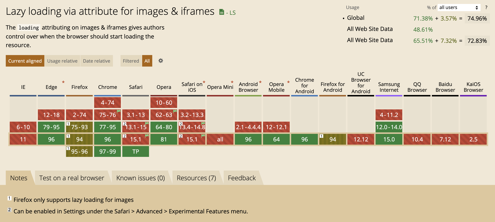

<!-- .slide: data-background="./images/hero_bg.jpg" -->
<h1 class="title dark-background"><span class="translucent">Get in the Fast Lane:</span> Measuring Web Performance</h1>
<h2 class="subtitle">Sia Karamalegos</h2>

-v-

## hi, i'm sia

⚡ 👩🏻‍💻 🇬🇷 🐶 🐺 🎨 📓 ✈️


-v-

## Links for today

- **Slides**: [bit.ly/perf-work](http://bit.ly/perf-work)
- **Project** (pull down all branches):
  - no build tool: [bit.ly/md-view-simple](https://bit.ly/md-view-simple)
  - with webpack: [bit.ly/markdown-viewer](http://bit.ly/markdown-viewer)

-v-

## Coding is more fun with friends 🧑🏽‍🤝‍🧑🏻

- 👋 Introduce yourself to your neighbors
- 🍐Pair programming is a great option!
- 💬 Ask lots of questions

Note: Suggest pair programming and give them an opportunity to change seats.

-v-

## Take out a piece of paper...


---

# Topics

<table id="contents-table" style="font-size:0.9em;">
  <tbody>
    <tr>
      <td><a href="#/2">🤷🏼 Intro: Why?</a></td>
      <td><a href="#/9">🏊🏿‍♀️ Deep-Dive: JavaScript+ in Webpack</a></td>
    </tr>
    <tr>
      <td><a href="#/3">🧪 Test environments</a></td>
      <td><a href="#/10">💸 Smooth UI: Script execution costs</a></td>
    </tr>
    <tr>
      <td><a href="#/4">📈 Metrics</a></td>
      <td><a href="#/11">🍹 Real User Monitoring</a></td>
    </tr>
    <tr>
      <td>
        
        <a href="#/5">Set up DevTools #LikeABoss</a>
      </td>
      <td><a href="#/12"> 🎷 Smooth UI: Other costs</a></td>
    </tr>
    <tr>
      <td><a href="#/6">⌚ Download cost: Latency</a></td>
      <td><a href="#/13">🦸🏻‍♀️ Accessibility debugging</a></td>
    </tr>
    <tr>
      <td><a href="#/7">📸 Download cost: Images</a></td>
      <td><a href="#/14">✏️ Exit Ticket</a></td>
    </tr>
    <tr>
      <td><a href="#/8">💰 Download cost: JavaScript</a></td>
      <td><a href="#/15">🤔 Closing: Perceived performance</a></td>
    </tr>
  </tbody>
</table>

---

<!-- .slide: data-background="./images/elevator2.jpg" -->
<h1 class="dark-background">
  <span class="highlighter">Why do elevators have mirrors?</span>
</h1>

Note: Intro

-v-

# Why Should I Care?

-v-

> Pinterest reduced load times by 40% and saw a 15% increase in sign ups.

<small>https://wpostats.com/</small>

-v-

> Starbucks implemented a 2x faster time to interactive resulting in a 65% increase in rewards registrations.

<small>[Chrome Dev Summit 2018](https://www.youtube.com/watch?v=Xryhxi45Q5M&t=1113s&index=6&list=PLNYkxOF6rcIDjlCx1PcphPpmf43aKOAdF )</small>

-v-

> AliExpress reduced load by 36% and saw a 10.5% increase in orders.

<small>https://wpostats.com/</small>

-v-

> Speed is now used as a ranking factor for mobile searches.

<small>https://developers.google.com/web/updates/2018/07/search-ads-speed</small>

Note: In 2016, Doubleclick by Google released a report saying that 53% of mobile sites are abandoned if pages take longer than 3 seconds to load.

-v-


<small>[Moving towards a faster web](https://blog.chromium.org/2019/11/moving-towards-faster-web.html)</small>

-v-

The internet consumes 416.2 TWh of electricity per year. A 10% savings would be equivalent to:

- 6.2 million fewer cars on the road 🚗 <!-- .element: class="fragment fade-in-then-semi-out" -->
- 32 billion less pounds of coal being burned 💨 <!-- .element: class="fragment fade-in-then-semi-out" -->
- 486 million tree seedlings grown for 10 years 🌳 <!-- .element: class="fragment fade-in-then-semi-out" -->

<small>[How is your website impacting the planet?](https://www.websitecarbon.com/), [Greenhouse Gas Equivalencies Calculator](https://www.epa.gov/energy/greenhouse-gas-equivalencies-calculator)</small>

Note: Most of the energy is consumed by the network and data center, not users' devices.

---

# 🧪 Test Environments 🧪

-v-

## Exercise Time!

<video autoplay loop>
  <source src="./images/arnold_cats.mp4" type="video/mp4">
  Sorry, your browser doesn't support embedded videos.
</video>

-v-

## Exercise: Flying Blind ✈️

Pick a website you work on. Run it through each of these tools, keeping each open in separate tabs:

1. **Lighthouse** (DevTools audit tab, only check performance)
2. **PageSpeed Insights** [developers.google.com/speed/pagespeed/insights/](https://developers.google.com/speed/pagespeed/insights/)
3. **WebPageTest** [webpagetest.org/easy](http://webpagetest.org/easy)
4. **Test My Site** [testmysite.thinkwithgoogle.com](https://testmysite.thinkwithgoogle.com)
5. **RespImageLint** [ausi.github.io/respimagelint/](https://ausi.github.io/respimagelint/) (requires some set up)

Note: **Discussion**: What do you notice about each? What are the similarities/differences? What do you like/dislike?

-v-

## Testing Environments

<br>

<table class="fixed-two-column" id="invisible-gridlines">
  <thead>
    <tr>
      <th>Lab/Synthetic</th>
      <th>Field/Real User Monitoring (RUM)</th>
    </tr>
  </thead>
  <tbody>
    <tr>
      <td>
        <ul class="plus-minus" style="display:inline;">
          <li class="plus">Controlled environment</li>
          <li class="plus">Predefined network and device settings</li>
          <li class="plus">Reproducible for better performance debugging</li>
          <li class="minus">May not capture real-world bottlenecks</li>
        </ul>
      </td>
      <td>
        <ul class="plus-minus" style="display:inline;">
          <li class="plus">Performance data from <strong>real user page loads</strong> and interactions</li>
          <li class="minus">Limited data and performance debugging capability</li>
      </td>
    </tr>
  </tbody>
</table>


-v-

## Lab/Synthetic Environment Tools

_Emulated CPU and network throttling_

<div id="dev-tool">
  
  <div>Chrome DevTools</div>
</div>
<div id="dev-tool">
  
  <div>Lighthouse</div>
</div>
<div id="dev-tool">
  
  <div>PageSpeed Insights</div>
</div>

Note: DevTools for Network tab (load) and Performance tab (script execution costs)

-v-

> Your laptop is a filthy liar.

<small>Alex Russell, [Progressive Performance talk at Chrome Dev Summit 2016](https://www.youtube.com/watch?v=4bZvq3nodf4)</small>

Note: network and CPU throttling are not representative of real user experiences. mobile CPUs process in a completely different way, and heat management is especially different.

-v-

## Optimize for the device and network your users have

- 2-5x difference in fastest vs slowest phones
- 75% of worldwide mobile connections on 2G or 3G
- Not just developing countries but rural areas or spotty networks like conference wifi
- Use analytics data to profile your users and configure [webpagetest.org](https://www.webpagetest.org/) to reflect them more closely

<small>https://infrequently.org/2017/10/can-you-afford-it-real-world-web-performance-budgets/</small>

Note: Performance budgets at Google are $200 Android phone on a slow 3G network to target 5s initial load and 2s for subsequent. Converts to 130-170kb gzipped.

-v-

## Lab/Synthetic Environment Tools

_Real devices and networks_

<div id="dev-tool">
  
  <div>WebPageTest<br>&nbsp;</div>
</div>

<div id="dev-tool">
  
  <div>DevTools +<br>connected device 📱</div>
</div>

Note: Buy a shitty phone and connect it to your computer for on-device debugging. webpagetest.org/easy has a basic set up - $200 phone, slow 3G?

-v-

## WebPageTest


<small>https://twitter.com/HenriHelvetica/status/1109557588411203584</small>

-v-

## Field/RUM Testing Tools

_Publicly available data_

<div id="dev-tool">
  
  <div>CrUX</div>
</div>

<div id="dev-tool">
  
  <div>PageSpeed Insights</div>
</div>

<div id="dev-tool">
  
  <div>Google BigQuery</div>
</div>

<small>Chrome User Experience (CrUX) data is available in PageSpeed Insights or BigQuery.</small>

-v-

## Field/RUM Testing Tools

_Self-run data sent to your backend or analytics tool_

- Navigation Timing API
- Resource Timing API
- User Timing API for custom timings

<small>
  <p>
    <a href="https://developers.google.com/web/fundamentals/performance/navigation-and-resource-timing/">Assessing Loading Performance in Real Life with Navigation and Resource Timing</a>
    <br /><a href="https://www.keycdn.com/blog/user-timing/">User Timing API - Measuring User Experience Performance</a>
  </p>
<small>

-v-

# More tools in the toolbox

-v-

## Test My Site


- Snazzy-looking and gives pretty pdf
- High-level data from WebPageTest and PageSpeed Insights
- Good for the speed scorecard and impact calculator

-v-

## RespImageLint

[RespImageLint](https://github.com/ausi/respimagelint) is a bookmarklet linter for responsive images.


Note: Lighthouse audits also does this better now, but I still like this quick tool and the prescriptive suggestions.

-v-

## Bundle Analyzers

- Several webpack tools exist - check out options on [SurviveJS](https://survivejs.com/webpack/optimizing/build-analysis/)
- One of my favorites: `webpack-bundle-analyzer`


-v-

## MOAR Tools

- [Dev Tools Coverage analyzer](https://developers.google.com/web/tools/chrome-devtools/coverage)
- [Performance Budget Calculator](https://perf-budget-calculator.firebaseapp.com/)
- [Bundlephobia](https://bundlephobia.com/)
- [Cloudinary Website Speed Test Image Analysis Tool](https://webspeedtest.cloudinary.com/)

Note: Cmd+shift+p for "coverage"

---

# 📈 Metrics 📈

-v-

> When optimizing for speed, <br>**user experience** should always <br>be your primary metric.

-v-

## User experience

1. When can I see the page? <!-- .element: class="fragment fade-in-then-semi-out" -->
2. When can I interact with it? <!-- .element: class="fragment fade-in-then-semi-out" -->
3. Is it delightful? <!-- .element: class="fragment fade-in-then-semi-out" -->

Note: By delightful I mean both is it stable and smooth.

-v-

## When can I see the page?

- Speed index measures how quickly the page contents are visually populated, but it's not simple<!-- .element: class="fragment fade-in-then-semi-out" -->
- Largest contentful paint measures when the largest image or text paint in the viewport occurs<!-- .element: class="fragment fade-in" -->
  - Elements removed from the DOM are invalidated (splash screens)<!-- .element: class="fragment fade-in" -->
  - Will have a larger weight in Lighthouse<!-- .element: class="fragment fade-in" -->

<small>[Largest Contentful Paint (LCP)](https://web.dev/lcp/), [Speed Index](https://sites.google.com/a/webpagetest.org/docs/using-webpagetest/metrics/speed-index)</small>

-v-

## When can I interact with the page?

<iframe width="560" height="315" src="https://www.youtube.com/embed/Lx1cYJAVnzA" frameborder="0" allow="autoplay; encrypted-media" allowfullscreen></iframe>

<small>End to End Apps with Polymer by Kevin Schaaf, Polymer Summit 2017</small>

-v-

## When can I interact with the page?

- Time to Interactive (TTI) measures how long it takes a page to become fully interactive<!-- .element: class="fragment fade-in-then-semi-out" -->
- Total blocking time (TBT) measures the time between First Contentful Paint (FCP) and TTI where the main thread was blocked for long enough to prevent input responsiveness.<!-- .element: class="fragment fade-in-then-semi-out" -->
- First Input Delay (FID) measures the delta between when an input event is received and when the main thread is next idle (field only).<!-- .element: class="fragment fade-in-then-semi-out" -->
- Large blocks of scripting on the main thread makes interaction worse.<!-- .element: class="fragment fade-in-then-semi-out" -->

<small>[How does TBT relate to TTI?](https://web.dev/tbt/#how-does-tbt-relate-to-tti), [First Input Delay](https://web.dev/fid/)</small>

Note: the point at which layout has stabilized, key webfonts are visible, and the main thread is available enough to handle user input within 50ms. The main thread is considered "blocked" any time there's a Long Task—a task that runs on the main thread for more than 50 milliseconds (ms). TBT will have a larger weight in Lighthouse.

-v-

## Is it delightful? Visual Stability...

<video controls width="800" autoplay loop>
  <source src="./images/layout-shift.mp4" type="video/mp4">
  Sorry, your browser doesn't support embedded videos.
</video>

-v-

## Visual Stability: CLS

**Cumulative Layout Shift** (CLS) is a new metric that:

> measures the sum total of all individual layout shift scores for every unexpeceted layout shift that occurs during the entire lifespan of the page.

<small>[From web.dev](https://web.dev/cls/)</small>

-v-

## Is it smooth? Frame Rate...


Note: Frame rate or frames per second (fps), is one measure of responsiveness. Modern devices refresh their screens at a rate of 60 fps. Converting that to an individual frame, we theoretically have 16 ms to render. In actuality, the browser needs some of that time, so we should target 10ms per frame. Any more, and the human eye will be able to detect the jank or jitter.

-v-

## RAIL model for performance goals

- **Response**: process events in under 50ms
- **Animation**: produce a frame in 10ms (for 60fps devices)
- **Idle**: maximize idle time (to respond in 50ms or less)
- **Load**: deliver content and become interactive in under 5 seconds, 2 seconds for subsequent loads*

<small>[Measure Performance with the RAIL Model](https://developers.google.com/web/fundamentals/performance/rail)</small>

Note: R:Complete a transition initiated by user input within 100ms. A: Have 16ms, but browsers need about 6ms to render each frame. I: Maximize idle time to increase the odds that the page responds to user input within 50ms. L:on mid-range mobile devices with slow 3G connections

-v-

## Core Web Vitals


<small>[Web Vitals](https://web.dev/vitals/), [The Science Behind Web Vitals](https://blog.chromium.org/2020/05/the-science-behind-web-vitals.html)</small>

Note: Target is 75% of loads. "Core Web Vitals are the subset of Web Vitals that apply to all web pages, should be measured by all site owners, and will be surfaced across all Google tools. Each of the Core Web Vitals represents a distinct facet of the user experience, is measurable in the field, and reflects the real-world experience of a critical user-centric outcome."

-v-

## Exercise: Metrics

Look at the tools you ran earlier, and write down:

1. The site's speed index, LCP, TTI, TBT, FID, and CLS.
2. Which tools did you find them in?
3. Under what conditions were these run (device, network, emulated/real?
4. Bonus: Which tool lets you test performance while using the app (not loading)?

-v-

## Go to the next level with user-centered metrics

- Twitter: [time-to-first-tweet](https://blog.twitter.com/engineering/en_us/a/2012/improving-performance-on-twittercom.html)
- Pinterest: [pinner-wait-time](https://medium.com/pinterest-engineering/driving-user-growth-with-performance-improvements-cfc50dafadd7)

<small>[Custom metrics](https://web.dev/custom-metrics/) on web.dev</small>

-v-

## Exercise: user-centered metrics

Brainstorm custom metrics that would make or break a user's experience on your own website. Have you considered measuring these directly?

---

# Set up Dev Tools #LikeABoss


-v-

## Exercise: Set up Dev Tools #LikeABoss


[bit.ly/boss-devtools](http://bit.ly/boss-devtools)

Note: Go through handout. Drag tabs to reorder.

-v-

## Dev Tools High-Level Orientation

- **Performance**: script and other execution costs (flame chart)
- **Network**: download time (waterfall)
- **Audits**: scores performance, PWAs, accessibility, etc (Lighthouse)
- **Coverage**: shows used vs. unused bytes includes in the load

Note: Lots of other cool tools exist like local overrides, paint layers, etc.

-v-

## Chrome Dev Tools Network Tab


-v-

## WebPageTest Waterfall



Note: green - downloaded before started rendering so these files could be bottlenecks for rendering (js or css). Thumbnail view: scrolling moves the red line, gold border = visual change happened. https://webpagetest.org/result/200525_57_18cda7ecd946450919406f43121c34d0/

-v-

## Look for patterns of poor performance...

-v-


Note: No cert so HTTP1 can only download 6-ish files at once.

-v-


Note: Many connections to different domains.

-v-


Note: Chained critical path/request depth - one file calling the next file calling the next.

-v-


-v-


Note: Is the script critical? If not, async/defer. If so, put before CSS.

-v-

By default, scripts are HTML parser blocking.


<small>[HTML spec: scripting](https://html.spec.whatwg.org/multipage/scripting.html)</small>

-v-

`defer` downloads without blocking, then waits to execute after the document is parsed. `defer` scripts are executed in order.


<small>[HTML spec: scripting](https://html.spec.whatwg.org/multipage/scripting.html)</small>

Note: Scripts with the defer attribute will execute in the order in which they appear in the document.

-v-

`async` downloads without blocking, then executes right away, blocking HTML parsing.


<small>[HTML spec: scripting](https://html.spec.whatwg.org/multipage/scripting.html)</small>

Note: Scripts with the defer attribute will execute in the order in which they appear in the document.

-v-

`type=module` is deferred by default unless given an `async` attribute.


<small>[HTML spec: scripting](https://html.spec.whatwg.org/multipage/scripting.html)</small>

Note: Scripts with the defer attribute will execute in the order in which they appear in the document.

-v-


<small>[HTML spec: scripting](https://html.spec.whatwg.org/multipage/scripting.html), [`<script>`: The Script element](https://developer.mozilla.org/en-US/docs/Web/HTML/Element/script) on MDN</small>

-v-

## Exercise: Why is our site so slow?

- Go to the deployed version of our app:
  - No build tool version: [turtle-no-build.netlify.app/](https://turtle-no-build.netlify.app/)
  - Webpack version: [bit.ly/turtle-mv](http://bit.ly/turtle-mv).
- Use Dev Tools or other tools to write down a list of things we might want to improve.

Note: In the next units, we'll learn about the biggest issues that cause slow websites and fix them. Then this process won't feel as foreign next time you do it.

---

# ⌚ Latency ⌚

Note: Who is brave enough to admit they don't really know what that means?

-v-

<section>
  <h2>latency</h2>
  <p>/ˈlātənsē/</p>
  <ol>
	  <li class="fragment fade-in-then-semi-out">the state of existing but not yet being developed or manifest; concealment.
      <br /><small><em>"tension, and the latency of violence, make the greatest impressions"</em></small></li>
	  <li class="fragment fade-in-then-semi-out">the delay before a transfer of data begins following an instruction for its transfer.
      <br /><small><em>"poor performance due to network latency"</em></small></li>
  </ul>
</section>

-v-

> Bandwidth is the width of the tube and latency is its length.

<small>[A brief guide to using WebpageTest](https://davidea.st/articles/a-brief-guide-to-webpagetest)</small>

-v-

For large or content-heavy sites like Netflix, bandwidth is critical. For everyone else, it's the **latency**.

-v-

<iframe src="https://player.vimeo.com/video/14439742" width="640" height="480" frameborder="0" allow="autoplay; fullscreen" allowfullscreen></iframe>

<small><a href="https://vimeo.com/14439742">Packet Flight: HTTP request @ 40X</a> from <a href="https://vimeo.com/carlosb">Carlos Bueno</a> on <a href="https://vimeo.com">Vimeo</a>. [TCP congestion control](https://en.wikipedia.org/wiki/TCP_congestion_control)</small>

-v-


<small>[What Is TCP Slow Start](https://www.keycdn.com/support/tcp-slow-start)</small>

-v-


Note: look at variations in image lines - can visually see TCP slow start.

-v-


<small>[keycdn Performance Test tool](https://tools.keycdn.com/performance)</small>

-v-

## Latency Exercise #1

1. Perform a Network profile on [nolalibrary.org/](http://nolalibrary.org/)
2. Now, perform a Network profile on one of these websites: [marvel.com/captainmarvel/](https://www.marvel.com/captainmarvel/), [clioandcalliope.com](https://www.clioandcalliope.com/), [nola.gov/](https://www.nola.gov/)
3. Compare the two, focusing on assets from the same domain (ignore ads and third-party scripts). How do the shapes of the waterfalls compare? Are they chained or concurrent?

-v-

## HTTP/1.1


<small>https://deliciousbrains.com/performance-best-practices-http2/</small>

Note: Starts downloading assets as TCP connections become available

-v-

## HTTP/2


<small>https://deliciousbrains.com/performance-best-practices-http2/</small>

Note: In addition, header compression. HTTP2 server push has not lived up to the promise, but it's still a new area. For the most part, need to use https.

-v-

http://ishttp2fastyet.com/

-v-


<small>https://twitter.com/jaffathecake/status/1044121129848377344</small>

-v-

# Caching


<small>Photo by chuttersnap on Unsplash</small>

-v-

Don't forget to set your headers!



<small>[Prevent unnecessary network requests with the HTTP Cache](https://web.dev/http-cache/#cache-control), [HTTP Cache Headers - A Complete Guide](https://www.keycdn.com/blog/http-cache-headers)</small>

-v-

Use service workers for offline access and custom caching behavior.

<small>[Service workers and the Cache Storage API](https://web.dev/service-workers-cache-storage/)</small>

-v-

# Fonts


<!-- .slide: data-background="./images/AA-font.jpg" -->

-v-


<div style="background-color:rgba(255,255,255,0.75);padding:20px;">

> Typography is what language looks like.

<small>—Ellen Lupton, Thinking with Type</small>

</div>

-v-


<small>[When Typography Speaks Louder Than Words](https://www.smashingmagazine.com/2012/04/when-typography-speaks-louder-than-words/)</small>

-v-


<small>[When Typography Speaks Louder Than Words](https://www.smashingmagazine.com/2012/04/when-typography-speaks-louder-than-words/)</small>

-v-


-v-

<h1 class="dark-background">
  <span class="highlighter">What annoys you about fonts?</span>
</h1>

-v-

## Webfonts

<ul class="plus-minus">
  <li class="plus">Hosted on fast and reliable CDNs</li>
  <li class="plus">Can provide optimized variants based on user's browser</li>
   <li class="plus"><del>Opportunity for shared caching on popular fonts</del></li>
  <li class="plus">We now have control over FOUT and FOIT!</li>
  <li class="minus">Minumum of 2 separate requests</li>
  <li class="minus">Can't use resource hints on the font file</li>
  <li class="minus">Doesn't take advantage of HTTP2 multiplexing</li>
</ul>

-v-

## Exercise Time!

<video autoplay loop playsinline muted>
  <source src="./images/hamster.mp4" type="video/mp4">
  Sorry, your browser doesn't support embedded videos.
</video>

-v-

## Latency Exercise #2

1. Run a network profile on [bit.ly/webfont-css](http://bit.ly/webfont-css).
<!-- Go to this webpagetest profile: [tinyurl.com/y5bl5ksn](https://tinyurl.com/y5bl5ksn). Click on the waterfall for Run 2 (the median run). -->
2. Focus on the all the CSS and font-related lines.
3. Write down the steps that are happening. The code is at [bit.ly/webfont-css-code](http://bit.ly/webfont-css-code). What do you notice?

Note: Need to answer question for both Google and local font. Google font is waiting to DL CSS until after current CSS, and local font is waiting until after current CSS though we know we want it.

-v-


<small>[WebPageTest waterfall](http://webpagetest.org/customWaterfall.php?test=190406_EP_2dc139e2f92f617a2ec5f39624d6c8ca&run=2&width=930)</small>

Note: pause here and ask what else seems wasteful - calling from css and connection time to 2nd domain

-v-

## Loading Google Fonts from CSS

```css
@import url('https://fonts.googleapis.com/css?family=Open+Sans:400,700');
```


<small>[WebPageTest waterfall](http://webpagetest.org/customWaterfall.php?test=190406_EP_2dc139e2f92f617a2ec5f39624d6c8ca&run=2&width=930)</small>

Note: pause here and ask what else seems wasteful - the connection time to fonts.gstatic.com

-v-

## Loading Google Fonts from HTML

```html
<link href="https://fonts.googleapis.com/css?family=Muli:400"
      rel="stylesheet">
```


-v-

## Loading Google Fonts from HTML

```html
<link href="https://fonts.googleapis.com/css?family=Muli:400"
      rel="stylesheet">
```
<!-- TODO: animate the image to show circle on click and slow bc no preconnect -->


-v-


<small>https://twitter.com/addyosmani/status/743571393174872064?lang=en</small>

Note: dns-prefetch only does the dns part of the prefetch, but on the plus side, it doesn't expire after a short amount of time.

-v-

## Loading Google Fonts with preconnect to fonts.gstatic.com

```html
<link rel="preconnect" href="https://fonts.gstatic.com/" crossorigin>
<link href="https://fonts.googleapis.com/css?family=Muli:400"
      rel="stylesheet">
```


-v-

## Self-Hosted Fonts

```html
<link as="font" type="font/woff2"
  href="./fonts/muli-v12-latin-regular.woff2" crossorigin>

<link as="font" type="font/woff2"
  href="./fonts/muli-v12-latin-700.woff2" crossorigin>
```


<small>[WebPageTest waterfall](http://webpagetest.org/customWaterfall.php?test=190406_S0_0a529e9ce6086cbea8e3aadc942ddbf6&run=2&width=930)</small>

-v-

## Self-Hosted Fonts

```html
<link as="font" type="font/woff2"
  href="./fonts/muli-v12-latin-regular.woff2" crossorigin>

<link as="font" type="font/woff2"
  href="./fonts/muli-v12-latin-700.woff2" crossorigin>
```


-v-

## Preloading self-hosted fonts*

```html
<link rel="preload" as="font" type="font/woff2"
  href="./fonts/muli-v12-latin-regular.woff2" crossorigin>

<link rel="preload" as="font" type="font/woff2"
  href="./fonts/muli-v12-latin-700.woff2" crossorigin>
```


<small>* Note that `preload` loads a resource whether used or not. Only preload resources that are needed on a particular page.</small>

Note: `rel="preload"` tells the browser to declaratively fetch the resource but not “execute” it (our CSS will queue usage). `as="font"` tells the browser what it will be downloading so that it can set an appropriate priority. Without it, the browser would set a default low priority. `type="font/woff2` tells the browser the file type so that it only downloads the resource if it supports that file type. `crossorigin` is required because fonts are fetched using anonymous mode CORS.

-v-



<small>[caniuse](https://caniuse.com/#feat=link-rel-preload)</small>

-v-

## [Shared Cache is Going Away](https://www.jefftk.com/p/shared-cache-is-going-away)

<small>[Chrome](https://www.chromestatus.com/feature/5730772021411840), [Firefox](https://bugzilla.mozilla.org/show_bug.cgi?id=1536058), [Safari](https://bugs.webkit.org/show_bug.cgi?id=110269)</small>
<!-- .slide: data-background="./images/no.jpg" -->

-v-


<div style="background-color:rgba(255,255,255,0.75);padding:20px;">

# UX: Font Rendering <!-- .element: style="color:#333" -->

</div>

-v-

## FOIT


Note: FOIT in action — note the missing navbar text in the filmstrip screenshot (throttled to slow 3G)

-v-

## `font-display`


<small>https://font-display.glitch.me/</small>

Note: add the `font-display` property to the `@font-face` declaration

-v-


<small>https://twitter.com/addyosmani/status/1128548064287952896/</small>

-v-

## FOUT

<video autoplay loop>
  <source src="./images/fout.mp4" type="video/mp4">
  Oops, video not supported
</video>

-v-

> The style doesn’t matter so much, it’s that it has to flow the same way.

— Tim Brown, Twitter

-v-

## Font Style-Matcher by Monica Dinculescu

[meowni.ca/font-style-matcher/](https://meowni.ca/font-style-matcher/)

-v-

## Exercise: Font Latency &amp; Display Optimization

Let's make our markdown viewer faster!
<br>[bit.ly/markdown-viewer](http://bit.ly/markdown-viewer)

1. Move the Google font load to HTML from CSS.
2. Preconnect to fonts.gstatic.com.
3. Preload the local fonts.
4. Fix the FOIT for both web and local fonts.
5. Bonus: Use cmd + shift + p to turn on "Show coverage". Record a load and click on the results. What do you notice?

-v-

## More Latency and Caching Strategies

- Adjust network download priority with **priority hints**
- Use appropriate **caching headers**
- Use **service workers** for precaching and offline optimization
- **Lazy-load** non-critical assets (below-the-fold assets like images, components in JavaScript, etc.)
- Use SVGs instead of icon fonts or subset the font.
- Inline critical CSS with [Critical](https://github.com/addyosmani/critical) and asynchronously load non-critical CSS with [loadCSS](https://github.com/filamentgroup/loadCSS).

<small>[Preload, Prefetch And Priorities in Chrome](https://medium.com/reloading/preload-prefetch-and-priorities-in-chrome-776165961bbf) by Addy Osmani</small>

Note: PRPL pattern - push, render, pre-cache, lazy-load

-v-

## More resources mentioned

- [Making Google Fonts Faster⚡](https://sia.codes/posts/making-google-fonts-faster/) - includes how do download and host locally
- [Google Analytics + caniuse = *MAGIC*](https://sia.codes/posts/google-analytics-caniuse-magic/) - how to import your Google Analytics data into caniuse
- [Shared Cache is Going Away](https://www.jefftk.com/p/shared-cache-is-going-away)
- [subfont](https://github.com/Munter/subfont)

---

<!-- .slide: data-background="./images/yellow-camera.jpg" -->
<h1 class="title" style="text-align:left;color: rgb(214, 61, 31);">Optimized, <br><span class="translucent">Responsive </span><br>Images</h1>

-v-

Images account for 50% of the bytes transferred <br>(median) needed to load a webpage.

<small>[httparchive.org](https://httparchive.org), January 2020</small>

-v-


<small>[httparchive.org](https://httparchive.org), January 2020</small>

-v-

## kB by Percentile


<small>[httparchive.org](https://httparchive.org), January 2020</small>

-v-

"18% of global Android Chrome users have Lite Mode enabled (aka Save-Data)"


<small>https://twitter.com/colinbendell/status/1265675813204172810</small>

Note: true numbers higher https://twitter.com/addyosmani/status/1265677876608655361

-v-

# #Goals

-v-

<large style="font-size: 48px">Users shouldn't download<br> unnecessary bytes. 💾</large>

-v-

<large style="font-size: 48px">Images should look good. 💅🏼</large>

-v-

<large style="font-size: 48px">Stop the layout shift. ✋🏽</large>

-v-

## Responsive &amp; Optimized Toolbox 🧰

- Best file format <!-- .element: class="fragment fade-in-then-semi-out" -->
- Right size and resolution <!-- .element: class="fragment fade-in-then-semi-out" -->
- Art direction <!-- .element: class="fragment fade-in-then-semi-out" -->
- Lazy loading <!-- .element: class="fragment fade-in-then-semi-out" -->

-v-

<!-- .slide: data-background="./images/disk-drive.jpg" class="dark-highlighter" -->

# File Format <!-- .element: class="dark-background" style="color:#fecf16" -->

-v-

> Choosing the right image format... can be far more important than any flashy new “responsive image” technique.

<small>Mat Marquis, [Image Performance](https://abookapart.com/products/image-performance)</small>

Note: Responsive Issues Community Group (RICG) chair. Getting the right image format is more important than any responsive image technique.

-v-

## Raster vs Vector


<small>https://commons.wikimedia.org/wiki/File:Bitmap_VS_SVG.svg</small>

Note: Raster images contain a set of data about a 2D grid of pixels. Vectors are a system of coordinates and "vectors" than can be redrawn at any size. Rasters are good for photo-realism. Raster file formats are really just different compression methods.

-v-

<svg version="1.1" width="300" height="200" xmlns="http://www.w3.org/2000/svg"><rect width="100%" height="100%" fill="turquoise" /><circle cx="150" cy="100" r="80" fill="rebeccapurple" /><text x="150" y="125" font-size="60" text-anchor="middle" fill="white">SVG</text></svg>

```xml
<svg version="1.1"
     width="300" height="200"
     xmlns="http://www.w3.org/2000/svg">

  <rect width="100%" height="100%" fill="turquoise" />
  <circle cx="150" cy="100" r="80" fill="rebeccapurple" />
  <text x="150" y="125" font-size="60"
        text-anchor="middle" fill="white">SVG</text>
</svg>
```

Note: (vector) - best for limited colors and sharp lines (e.g., logos)

-v-

## GIF

Just. Don't.

<video controls width="700" autoplay loop>
  <source src="./images/dont.mp4" type="video/mp4">
  Sorry, your browser doesn't support embedded videos.
</video>

Note: (lossy) - fun but terrible. Use SVG or video instead. Inspect this (or on Twitter) and see that's it's video.

-v-

## PNG: photo-like images with transparency


Note: (lossless) - best for photo-realistic with transparency. **Lossless compression** - like using ZIP for a file but all the data is still saved.

-v-

## JPG: photo-like images with no transparency


Note: JPG is your photo workhorse. It's a lossy format that was created to compress by hue - in a way that human eyes are less likely to detect, so it's smaller than PNG. Use for all:

-v-

## Progressive JPG


<small>[What is a progressive JPEG?](https://www.liquidweb.com/kb/what-is-a-progressive-jpeg/) by Liquid Web</small>

Note: hard to tell when an image has actually finished loading. You might even get a bad impression from a website because “the photos look blurry” (while in fact the site was still loading and you only saw a progressive preview of the photos)

-v-

## WEBP: best of both worlds


<small>[caniuse](https://caniuse.com/#feat=webp)</small>

Note: WEBP is a new format available on most modern browsers (I'm looking at you, Safari) that combines the best of JPG and PNG with smaller sizes. It's lossy or lossless and supports transparency.

-v-

## Cheatsheet

- ✅ SVG: logos and icons <!-- .element: class="fragment fade-in-then-semi-out no-bullet" -->
- ❌ GIF: don't. use jpg for a still or video for animation. <!-- .element: class="fragment fade-in-then-semi-out no-bullet" -->
- ✅ PNG: photo-like images with transparency <!-- .element: class="fragment fade-in-then-semi-out no-bullet" -->
- ✅ JPG: photo-like images with no transparency <!-- .element: class="fragment fade-in-then-semi-out no-bullet" -->
- ✅ WEBP: smaller, but need to serve fallbacks <!-- .element: class="fragment fade-in-then-semi-out no-bullet" -->

<small>[Responsive Doggos Demo](https://projects.sia.codes/responsive-images-demo/)</small>

Note: Raster file formats are really just different compression methods. **SVG**: Can style and animate with CSS or make basic edits in XML. **GIF**: huge file sizes for animation, use video instead. svg or jpg are better for stills. Twitter converts GIF to video.  **PNG**: Use jpg if don't need transparency. **JPG**: much better compression algos.

-v-

<!-- .slide: data-background="./images/stormtrooper.jpg" -->

# Size &amp; Resolution <!-- .element: style="color:#333; text-align:left;" -->

&nbsp;

&nbsp;

&nbsp;

&nbsp;

-v-

## Demystifying DPR (device pixel ratio)

On a 2x screen, a displayed image width of 100px needs a 200px file/natural width image to look good.


Note: n this exaggerated example, the natural width of the bantha doggo on the left is 150px, then 300px, then 600px. The display width is 300px, and my screen has a DPR (device pixel ratio) of 2. 150px is fuzzy. Looking closely, the middle image is not the best quality either.

-v-

## `srcset`

```html

```

- States a set of images and the natural size of each image <!-- .element: class="fragment fade-in-then-semi-out" -->
- Browser assumes a display width of 100vw <!-- .element: class="fragment fade-in-then-semi-out" -->
- Files are candidates, not commands. <!-- .element: class="fragment fade-in-then-semi-out" -->

Note: States a set of images and the natural size of each image. Browser assumes a display width of 100vw.  Files are candidates, not commands.. Alternatively, use x-descriptors.

-v-

## `sizes`

```html

```

- States display width for a set of media conditions <!-- .element: class="fragment fade-in-then-semi-out" -->
- Order matters! First match is used. <!-- .element: class="fragment fade-in-then-semi-out" -->
- No media condition for the last one (default for no match). <!-- .element: class="fragment fade-in-then-semi-out" -->
- Add analogous CSS. <!-- .element: class="fragment fade-in-then-semi-out" -->

Note: Format is [media condition][space][display width]. Once again, these are candidates, not commands. We are letting the browser choose which file to use ultimately.

-v-

## RespImageLint FTW 🏆


<small>[RespImageLint bookmarklet](https://ausi.github.io/respimagelint/)</small>

-v-

<!-- .slide: data-background="./images/elder-phone.jpg" -->
<h1 style="text-align:right;">🤔</h1>

Note: How many different resolutions? Science suggests humans can see 720ppi 1 foot from a screen. The iPhone 11 is 326ppi (MBP is 227) so in most cases, you're safe providing only 1x and 2x. You might consider 4x in cases of high-resolution projectors or art.

-v-

## Image Exercise 1

1. **Analyze**
  - Write down how big our initial load is now.
  - Inspect ``, hover on filename to see displayed/ natural sizes.
  - Run the RespImageLint bookmarklet to get suggestions here and in step 2 for `sizes`. Be lazy!
2. **Optimize**
  - Replace the `png` image with an `svg`.
  - Use `srcset` and `sizes` to provide options for screens with DPRs of 1 and 2. Switch to `html-loader-srcset`.
2. **Debug**
  - Find your screen DPR: `window.devicePixelRatio`.
  - Discover which file is being used: Inspect > Properties > `img` > `currentSrc`. Start with a small screen size, then observe how this changes as you increase.

<small>[Sharp](https://www.npmjs.com/package/sharp) &amp; [Imagemagick](https://www.imagemagick.org/script/index.php) are great for resizing images. Examples at [Serve Responsive Images](https://web.dev/fast/serve-responsive-images).</small>

Note: Demo pups? Mention how behavior is different in different browsers. Sharp for JS and batch, Imagemagick for CLI. `convert galaxy.jpg -resize 720 galaxy_720.jpg`

-v-


<!-- .slide: data-background="./images/chilis.jpg" -->

&nbsp;

&nbsp;

&nbsp;

&nbsp;

# Art Direction <!-- .element: style="text-align:right;color:#111;" -->

-v-


Note: (1) Art direction is a technique for drawing attention to the most important parts, or targeting specific features of an image, even when it’s viewed on different devices or platforms. (2) So how do we do art direction?

-v-

## `<picture>`

- Provide multiple images based on device size, resolution, orientation, and more.
- Use `media` attribute for viewport spec. First match is used.
- Always provide `` last for no match or browsers that do not support `<picture>` and `<source>`

```html
<picture>
  <source media="(min-width: 800px)"
          srcset="wide_800.jpg 800w,
                  wide_1600.jpg 1600w">
  <source media="(min-width: 400px)"
          srcset="narrow_400.jpg 400w,
                  narrow_800.jpg 800w">
  
</picture>
```

Note: (1) In this `picture` tag, we have 2 sources and an img. Older browsers simply ignore the picture and source tags and use the img tag. (2) The video tag also works this way and can have multiple `source` tags

-v-

## Bleeding-Edge File Formats (WEBP!)

```html
<picture>
  <source type="image/webp" srcset="pug_life.webp">
  
</picture>
```

- Browser uses the first compatible file type.
- Set `` `src` to a format supported by all browsers.

Note: Browser uses the first compatible file type. Set `` `src` to a format supported by all browsers.

-v-

## CSS Background Images

- Use media queries for width and DPR
- Use postcss/autoprefixer to get prefixes
- Don't use `display: none;` as a perf strategy. Some browsers will still load hidden images.
- [Generate a CSS gradient](https://www.louisbourque.ca/Color-Extractor/) of your image to show during load.
- Lazy-load your background images.

```css
@media only screen and (min-width: 320px) {
  /* small screen, DPR = 1 */ }
@media only screen and (min-device-pixel-ratio: 2) and (min-width: 320px),
  only screen and (min-resolution: 192dpi) and (min-width: 320px),
  only screen and (min-resolution: 2dppx) and (min-width: 320px),{
  /* small screen, DPR = 2 */ }
```

Note: When should an image be in the HTML vs CSS?

-v-

# `display: none;`
# not a perf strategy.

Note: Some browsers will still load hidden images.


-v-

## webp, srcset, &amp; sizes, oh my! 🦁🐯🐻

```html
<picture>
  <source srcset="./images/sofa_pug_400.webp 400w,
                  ./images/sofa_pug_800.webp 800w"
          type="image/webp" />
  
</picture>
```

-v-

## Image Exercise 2

1. Provide `webp` formats with `jpg` fallbacks for one picture. Update webpack.config.js:

```diff
     rules: [
       {
         test: /\.html$/,
-        loader: 'html-loader-srcset'
+        use: {
+          loader: 'html-loader-srcset',
+          options: {
+            attrs: ['img:src', 'img:srcset', 'source:srcset']
+          }
+        }
       },
       {
-        test: /\.(png|jpg|gif|svg)$/,
+        test: /\.(png|jpg|gif|svg|webp)$/,
         use: ['file-loader']
       },
```

2. (Optional) Install `cwebp` and create `webp` versions of the other images. See next slide for getting started...

<!-- TODO: provide install and sample commands -->
<small>[developers.google.com/speed/webp/docs/cwebp](https://developers.google.com/speed/webp/docs/cwebp)

-v-

## `cwebp`

- Install:
  - Mac `brew install cwebp`, Windows `choco install webp`, Red Hat `yum install libwebp-tools`, Node-based `npm i -g cwebp-bin`
- Use:
  - Convert `source.png` to a lossy webp file `output.webp` with a quality of 75 (0-100): `cwebp -q 75 source.png -o output.webp`
  - Convert `source.png` to a lossless webp file `output.webp`: `cwebp -lossless source.png -o output.webp`
  - For lossless, control compression with `-z` (0-9 with 9 being highest compression but also longest encoding)

<small>[developers.google.com/speed/webp/docs/cwebp](https://developers.google.com/speed/webp/docs/cwebp)

-v-


<!-- .slide: data-background="./images/photo-collage.jpg" class="dark-highlighter" -->

# Generating Images & Markup <!-- .element: style="color:#fecf16;" -->

-v-


<small>[Images on the Command Line reference](https://github.com/siakaramalegos/images-on-the-command-line), [Tweet](https://twitter.com/TheGreenGreek/status/1201494377522225153)</small>

-v-

## Paid Services 💰

- [Cloudinary](https://cloudinary.com/)
- [Netlify large media](https://docs.netlify.com/large-media/overview/#large-media-docs)
- ...and many others

```bash
[baseUrl]/eeeps/image/upload/f_auto,q_70,w_512/photo.jpg
/images/apples.jpg?nf_resize=fit&w=300&h=400
```

<small>[Image Analysis Tool by Cloudinary](https://webspeedtest.cloudinary.com/)*</small>

-v-

## Other tooling options:

- Simple `` and server/serverless function selects best image to serve
- Build tools like various webpack loaders (but `sizes` not supported)
  - [responsive-loader](https://github.com/herrstucki/responsive-loader)
  - [gatsby-image](https://www.gatsbyjs.org/packages/gatsby-image/) and [gatsby-transformer-sharp](https://image-processing.gatsbyjs.org/)


Note: (1) Many people have their server hijack the request and serve the best image to minimize markup. Could also use a serverless function. (2) Cost money. (3) So many options - both create your srcset code and process the images

-v-

## Image Exercise 3 (webpack only)

1. Check out the footer background image HTML and CSS. Observe that a gradient has already been generated. Uncomment that line to implement.
2. Generate media queries to accommodate different screen sizes using `(min-resolution: 2dppx)`. Add `postcss-loader` and `autoprefixer` for the remaining prefixes ([docs](https://github.com/postcss/autoprefixer#what-is-the-unprefixed-version-of--webkit-min-device-pixel-ratio)):

```diff
       {
         test: /\.css$/,
-        use: ['style-loader', 'css-loader']
+        use: ['style-loader', 'css-loader', 'postcss-loader']
       },
```

```javascript
// postcss.config.js
module.exports = {
  plugins: [
    require('autoprefixer')
  ]
}
```

-v-

<!-- .slide: data-background="./images/falling-mountains.jpg" class="dark-highlighter" -->

# Layout Shift

-v-

<video controls width="800" autoplay loop>
  <source src="./images/layout-shift.mp4" type="video/mp4">
  Sorry, your browser doesn't support embedded videos.
</video>

-v-

```html

```

```css
img {
  height: auto;
  /* max-width: 100%; */
}
```

<small>[Do This to Improve Image Loading on Your Website](https://www.youtube.com/watch?v=4-d_SoCHeWE&feature=youtu.be) - video by Jen Simmons</small>

Note: Setting the height and width on the image sets an aspect ratio, and then the CSS is respected.

-v-

<video controls width="800" autoplay loop>
  <source src="./images/fixed-layout-shift.mp4" type="video/mp4">
  Sorry, your browser doesn't support embedded videos.
</video>

-v-

<!-- .slide: data-background="./images/loading.jpg" class="dark-highlighter" -->

# Loading <!-- .element: style="color:#fecf16;" -->

-v-


## ⚡🦄🌈⚡ Native lazy-loading ⚡🦄🌈⚡

```html
<!-- Lazy-load offscreen image when user scrolls near -->


<!-- Load an image immediately -->

```

<small>[addyosmani.com/blog/lazy-loading/](https://addyosmani.com/blog/lazy-loading/)</small>

-v-

# ⚡🦄🐈🌈🐼🍕🎂🍾🎉🐶🦄🐈🌈🐼🍕🎂🍾🎉🐶⚡🐈🌈🐼🍕🎂🍾🎉🐶⚡🦄🌈🐼🍕🎂🍾🎉🐶⚡🦄🐈

-v-

# 😭😭😭😭😭😭



<small>[caniuse](https://caniuse.com/#feat=loading-lazy-attr)</small>

-v-

In the meantime, use a tool like [lazysizes](https://github.com/aFarkas/lazysizes).

<small>Also check out: [Lazy load embedded YouTube videos](https://css-tricks.com/lazy-load-embedded-youtube-videos/) on CSS Tricks</small>

Note: Can also do a blur-up and calculate sizes for you.

-v-

## Image Exercise 4: Lazy Loading for Today &trade;

<small>(webpack only)</small>

- Install `lazysizes` ([docs](https://github.com/aFarkas/lazysizes)): `npm i lazysizes --save`
- Import in index.js: `import 'lazysizes';`
- Replace `src` with `data-src` and `srcset` with `data-srcset`. Add `lazyload` class to each ``. Add our small placeholder svg in the `src`.
  ```html
  
  ```
- In webpack config, add `:data-src` and `:data-srcset` to the `attrs` for `html-loader-srcset`.
- How big is our initial load now?

-v-


## Toolbox 🧰

- Use the right image type (png vs jpg, gif vs video). <!-- .element: class="fragment fade-in-then-semi-out" -->
- Serve the right size image for the user's screen width and device pixel ratio <!-- .element: class="fragment fade-in-then-semi-out" -->
- Compress images with a tool like ImageOptim, TinyPNG, SVGOMG, or use a webpack plugin like imagemin-webpack-plugin <!-- .element: class="fragment fade-in-then-semi-out" -->
- Use newer, improved formats like webp. <!-- .element: class="fragment fade-in-then-semi-out" -->
- Lazy loading with a tool like lazysizes <!-- .element: class="fragment fade-in-then-semi-out" -->

<br>
<br>
<small>
  Check out <a href="https://developer.mozilla.org/en-US/docs/Learn/HTML/Multimedia_and_embedding/Responsive_images">Responsive images</a> on MDN &amp; <a href="https://abookapart.com/products/image-performance">Image Performance</a> by Mat Marquis.
  <br><a href="https://www.npmjs.com/package/sharp">Sharp</a> &amp; <a href="https://www.imagemagick.org/script/index.php">Imagemagick</a> are great for resizing images. Examples at <a href="https://web.dev/fast/serve-responsive-images">Serve Responsive Images</a>. Use cwebp for creating webp files (<a href="https://developers.google.com/speed/webp/docs/cwebp">docs</a>).
</small>

---

# Download cost:<br>💰 JavaScript 💰

Note: Are all assets created equally?

-v-

## JavaScript: Your Most Expensive Asset

<iframe width="990.6990950226244" height="482" seamless frameborder="0" scrolling="no" src="https://docs.google.com/spreadsheets/d/e/2PACX-1vTlTFx0oq6iA73uPBd4X1kaF05-R82KHMMGF7wzgvPTvdgMsPyjKZk5fAPOmPhc33g_Zoul7EsB2Cg9/pubchart?oid=1765333686&amp;format=image"></iframe>

<small>Adapted from [The Cost of JavaScript](https://medium.com/dev-channel/the-cost-of-javascript-84009f51e99e) by Addy Osmani</small>

-v-

## TL;DR: Ship less code

- less code = less load + less parse/compile
- holy grail = prioritize only what's needed in view

-v-

## Exercise: JS DevTools, Part 1

1. On the Network tab, turn off any throttling so this doesn't take forever. 😂
2. Run a Network profile on one of the following: [cnn.com](https://www.cnn.com/), [bbc.com](https://www.bbc.com/), [nytimes.com](https://www.nytimes.com/), or any major news site.
3. What do you notice?

-v-

## Exercise: JS DevTools, Part 2

1. Type **cmd + shift + p**, then start typing "third" to find and turn on: `Appearance: Show third party badges`.
2. Now, what do you notice?

-v-

## Exercise: JS DevTools, Part 3: <br>3rd-party scripts analysis

1. Run a Performance profile on reload, without throttling.
2. Check out the Summary pane for full JS execution time.
3. Click on the Bottom-up pane. Play with the group by feature, especially domain and product.
4. Which 3rd-party scripts are the worst offenders?

-v-

## Exercise: JS DevTools, Part 4: 3rd-party scripts analysis

1. Go back to the Network tab, right-click on one or more of your worst offenders, and select "Block request domain".
2. Go back to the Performance tab and re-run the profile on reload.
3. Use the timeline sessions list to switch back and forth and compare the results.
4. **Discussion**: How can we use this info to improve performance?

Note: 3rd party scripts can be your biggest JS offender. Know how to find and measure them, and use that info to make better decisions within your organization or to pressure your vendors to write more efficient scripts.

-v-

## Exercise: Bundle Analysis, Part 1

1. Note that `webpack-bundle-analyzer` is already installed in our project.
2. Go to webpack.config.js and change `openAnalyzer` to `true`
3. Run `npm run build` to run the production build.
4. What do you notice about our JavaScript bundle? What are the biggest dependencies?
5. What would you see if you ran it in development?

-v-

## Module Imports

```javascript
// Big = 527kb
import _ from 'lodash';
_.isEmpty({});

// Big = 527kb
import {isEmpty} from 'lodash';
isEmpty({});

// Little = 24kb
import isEmpty from 'lodash/isEmpty';
isEmpty({})

// Big = 544kb
import moment from 'moment';

// Little = 11kb
import addMinutes from 'date-fns/add_minutes';
```

<small>Use Moment? Try [date-fns](https://date-fns.org/) instead.</small>

Note: Tree-shaking can help do this for us so we don't have to worry so much about doing our imports "correctly".

-v-

## Exercise: Bundle Analysis, Part 2

1. Find where Lodash is used in the project.
2. Update the import to only import the function(s) needed.
3. Re-run `npm run build` to see if it improved.
4. Hover over the various blocks. How did the sizes change for the whole bundle and for just Lodash?
5. Optional: Replace Moment with Date-fns single-function imports. How did the sizes change?

-v-

We can do so much more to optimize TTI, but we need to use our build tool to implement...

---

# 🏊🏿‍♀️ Deep-Dive: 🏊🏿‍♀️<br>JavaScript+ in Webpack

<small>+ CSS + images + ...</small>

-v-

## Why is my app so slow?

Let's profile our app with DevTools and Bundle Analyzer to generate a list of things to fix.

-v-

## Optimizing Time to Interactive

- **Only ship what's immediately needed** - use code splitting, pre-caching, and deferred or lazy loading.
- **Minify** to speed up both download and parse/compile.
- **Compress** with gzip or brotli.
- **Remove unused code** with tree shaking and using module imports effectively.
- Set up **performance budgets** to prevent performance creep.

<small>https://webpack.js.org/configuration/performance/</small>

-v-

## Exercise: Low-hanging fruit

- Set production mode
- Extract CSS from JS and minify
- Set browser targets for Babel
- Generate compressed bundles
- Disable source maps in production

-v-

## Set production mode

Sets `NODE_ENV` to `production` for smaller builds of some libraries and turns on script minification with Terser

```diff
  {
    ...
    "scripts": {
      "start": "NODE_ENV=development webpack-dev-server",
-     "build": "webpack"
+     "build": "webpack -p"
    },
    ...
  }
```

<small>See also: [the webpack docs for production builds](https://webpack.js.org/guides/production/)</small>

-v-

## Extract CSS from JS and minify

The MiniCssExtractPlugin docs have a great [section on production](https://webpack.js.org/plugins/mini-css-extract-plugin/#minimizing-for-production) that shows how to combine these:

- Use [`mini-css-extract-plugin`](https://github.com/webpack-contrib/mini-css-extract-plugin) to extract CSS from JS
- Use [`optimize-css-assets-webpack-plugin`](https://github.com/NMFR/optimize-css-assets-webpack-plugin) to optimize

-v-

## webpack.config.js

```diff
+const MiniCssExtractPlugin = require('mini-css-extract-plugin')
+const OptimizeCSSAssetsPlugin = require('optimize-css-assets-webpack-plugin');
+const TerserJSPlugin = require('terser-webpack-plugin');

 module.exports = {
   module: {
    rules: [
       {
         test: /\.css$/,
-        use: ['style-loader', 'css-loader']
+        use: [ MiniCssExtractPlugin.loader, 'css-loader' ]
       },
+  optimization: {
+    minimizer: [new TerserJSPlugin({}), new OptimizeCSSAssetsPlugin({})],
+  },
   plugins: [
-    new CleanWebpackPlugin()
+    new CleanWebpackPlugin(),
+    new MiniCssExtractPlugin({
+      filename: '[name].[hash].css',
+    }),
   ],
```

-v-

## Set browser targets for Babel

Create a `.browserslistrc`

```
last 2 versions
> 0.2%
not dead
```

<small>See also: [the Browserslist docs](https://github.com/browserslist/browserslist)</small>

-v-

## Compression

- `brotli` offers higher compression with a better algorithm, but `gzip` is more widely supported.
- Your hosting platform or CDN might be able to do this by default without you having to do it.
- Dynamic: the server compresses on request. Simpler build but potentially slower response.
- Static: performed at build. Slower build, but faster response.

Use [brotli-webpack-plugin](https://github.com/mynameiswhm/brotli-webpack-plugin) or [compression-webpack-plugin](https://github.com/webpack-contrib/compression-webpack-plugin) (gzip) for static compression with webpack.

-v-

## Compressing with `compression-webpack-plugin`

```bash
npm install -D compression-webpack-plugin
```

```diff
+const CompressionPlugin = require('compression-webpack-plugin');

 module.exports = {
   plugins: [
     new MiniCssExtractPlugin({
       filename: '[name].[hash].css',
     }),
+    new CompressionPlugin(),
   ],
```

-v-

## Disable source maps in production

```diff
  module.exports = {
    ...
-   devtool: 'source-map',
+   devtool: process.env.NODE_ENV === 'production' ? 'none' : 'source-map',
    ...
};

```

-v-

## Client vs Server vs Progressive Rendering

<iframe width="749.4849246231156" height="463.3975" seamless frameborder="0" scrolling="no" src="https://docs.google.com/spreadsheets/d/e/2PACX-1vTlTFx0oq6iA73uPBd4X1kaF05-R82KHMMGF7wzgvPTvdgMsPyjKZk5fAPOmPhc33g_Zoul7EsB2Cg9/pubchart?oid=882710936&amp;format=interactive"></iframe>

<small>Inspired by https://twitter.com/aerotwist/status/729712502943174657</small>

-v-

## Client vs Server vs Progressive Rendering

<iframe width="749.4849246231156" height="463.3975" seamless frameborder="0" scrolling="no" src="https://docs.google.com/spreadsheets/d/e/2PACX-1vTlTFx0oq6iA73uPBd4X1kaF05-R82KHMMGF7wzgvPTvdgMsPyjKZk5fAPOmPhc33g_Zoul7EsB2Cg9/pubchart?oid=2121502741&amp;format=interactive"></iframe>

<small>Inspired by https://twitter.com/aerotwist/status/729712502943174657</small>

-v-

## Client vs Server vs Progressive Rendering

<iframe width="749.4849246231156" height="463.3975" seamless frameborder="0" scrolling="no" src="https://docs.google.com/spreadsheets/d/e/2PACX-1vTlTFx0oq6iA73uPBd4X1kaF05-R82KHMMGF7wzgvPTvdgMsPyjKZk5fAPOmPhc33g_Zoul7EsB2Cg9/pubchart?oid=1240736189&amp;format=interactive"></iframe>

<small>Inspired by https://twitter.com/aerotwist/status/729712502943174657</small>

-v-

## Client vs Server vs Progressive Rendering

<iframe width="749.4849246231156" height="463.3975" seamless frameborder="0" scrolling="no" src="https://docs.google.com/spreadsheets/d/e/2PACX-1vTlTFx0oq6iA73uPBd4X1kaF05-R82KHMMGF7wzgvPTvdgMsPyjKZk5fAPOmPhc33g_Zoul7EsB2Cg9/pubchart?oid=1546390226&amp;format=interactive"></iframe>

<small>Inspired by https://twitter.com/aerotwist/status/729712502943174657</small>

Note: Paul Lewis coined the term "uncanny valley". Optimizing for content visibility instead of time to interactivity can leave users more frustrated.

-v-

## Client vs Server vs Progressive Rendering

<iframe width="749.4849246231156" height="463.3975" seamless frameborder="0" scrolling="no" src="https://docs.google.com/spreadsheets/d/e/2PACX-1vTlTFx0oq6iA73uPBd4X1kaF05-R82KHMMGF7wzgvPTvdgMsPyjKZk5fAPOmPhc33g_Zoul7EsB2Cg9/pubchart?oid=1471728610&amp;format=interactive"></iframe>

<small>Inspired by https://twitter.com/aerotwist/status/729712502943174657</small>

Note: PRPL - push minimal code for initial route, render route and get interactive, pre-cache using service workers, and lazy-load async routes. Progressive bootstrapping - Send down a minimally functional page (composed of just the HTML/JS/CSS needed for the current route). As more resources arrive, the app can lazy-load and unlock more features.


-v-

## Code Splitting Strategies

1. By **entry point** manually with `entry` config (better combined with #2 to prevent dupes)
2. Prevent duplication and **split chunks** with [SplitChunksPlugin](https://webpack.js.org/plugins/split-chunks-plugin/)
3. **Dynamic imports** via inline functions that are only imported when needed

<small>[webpack guide on code splitting](https://webpack.js.org/guides/code-splitting)</small>

-v-

## Exercise: Code Splitting

- Let's split our code to only ship what's immediately needed on load. We'll use [dynamic imports](https://webpack.js.org/guides/code-splitting#dynamic-imports) for the rest:
  ```diff
  - import thing from 'packagename';
  + import('packagename' /* webpackChunkName: "packagename" */)
  +   .then(thing => {
  +     // do stuff with the module here
  +   })
  ```
- First, add the Babel dependencies for dynamic imports:
  ```bash
  npm install -D @babel/plugin-syntax-dynamic-import @babel/plugin-transform-runtime
  npm install @babel/runtime
  ```
  ```diff
   {
     "presets": [
       "@babel/preset-env",
     ],
  +  "plugins": [
  +    "@babel/plugin-syntax-dynamic-import",
  +    "@babel/plugin-transform-runtime"
  +  ]
   }
  ```

Note: The reason we need default is that since webpack 4, when importing a CommonJS module, the import will no longer resolve to the value of module.exports, it will instead create an artificial namespace object for the CommonJS module

-v-

## Prefetch chunks while idle

```javascript
import('marked' /* webpackChunkName: "marked", webpackPrefetch: true */)
```

<small>Read more: [`<link rel="prefetch/preload">` in webpack](https://medium.com/webpack/link-rel-prefetch-preload-in-webpack-51a52358f84c) by Tobias Koppers</small>

Note: caveats about the prefetch queue even if suddenly needed now also definitely downloads so don't do too much of this

-v-

## Differential Serving, a.k.a. Serve modern code to modern browsers

```html
<!-- Browsers with ES module support load this file. -->
<script type="module" src="main.mjs"></script>

<!-- Older browsers load this file (and module-supporting -->
<!-- browsers know *not* to load this file). -->
<script nomodule src="main.es5.js"></script>
```

-v-

## The Cost of Unnecessary Transpiling

<table>
  <thead>
    <tr>
      <th>Version</th>
      <th>Size <br />(minified)</th>
      <th>Size <br />(minified + gzipped)</th>
      <th>Parse/eval time (avg)</th>
    </tr>
  </thead>
  <tbody>
    <tr>
      <td>ES2015+</td>
      <td>80K</td>
      <td><strong>21K</strong></td>
      <td><strong>172ms</strong></td>
    </tr>
    <tr>
      <td>ES5</td>
      <td>175K</td>
      <td><strong>43K</strong></td>
      <td><strong>367ms</strong></td>
    </tr>
  </tbody>
</table>

<small>https://philipwalton.com/articles/deploying-es2015-code-in-production-today/</small>

Note: We transpile and polyfill most code, but most users are on modern browsers. So why are we shippping Unnecessary code? What's the impact?  Webpack can create 2 bundles for you - transpiled to ES5 and not-transpiled ES2015+. These are the results from a small blog app - remember since JS is most expensive asset this affects not just download but parse and compile time. <strong>Bigger apps mean bigger gains</strong>. No time to go through how, but this article goes through the steps. (test using script type=module, set up separate webpack config and need to include modules

-v-

## Differential Serving Exercise 1: What's Babel doing?

1. Run Bundle Analyzer on prod to see our starting bundle size. Run the coverage checker in DevTools to see some of the unused code. Much of this is polyfills.
2. Update `.babelrc` to add debug:
  ```diff
   {
    "presets": [
  -    "@babel/preset-env",
  +    [
  +      "@babel/preset-env",
  +      {
  +        "debug": true
  +      }
  +    ]
    ],
    "plugins": [
      "@babel/plugin-syntax-dynamic-import",
  ```

-v-

## Differential Serving Exercise 1: What's Babel doing?

- Run `npm start` and look for the targets in your terminal log:
  ```bash
  Using targets:
  {
    "android": "4.4.3",
    "chrome": "49",
    "edge": "17",
    "firefox": "65",
    "ie": "11",
    "ios": "10.3",
    "opera": "58",
    "safari": "5.1",
    "samsung": "4"
  }
  ```
- Notice this line - it means it's importing ALL of babel/polyfill:
```bash
Using polyfills: No polyfills were added, since the `useBuiltIns`
option was not set.
```

-v-

## Differential Serving Exercise 2: Better polyfills

1. Limit the polyfills to only match the targeted browsers:
  ```diff
       {
         "debug": true
  +      "useBuiltIns": "entry"
       }
  ```
2. Limit the polyfills to only match those used:
  ```diff
  -      "useBuiltIns": "entry"
  +      "useBuiltIns": "usage"
  ```
3. Delete `import "@babel/polyfill";` from index.js.
4. Narrow the browsers supported to NOT include IE `.browserslistrc`:
  ```bash
  >0.25%
  not IE 11
  ```

-v-

## Differential Serving Exercise 3: Hold on to your butts

1. Add new dependencies:
  ```bash
  npm i --save core-js
  npm i --save-dev webpack-merge script-ext-html-webpack-plugin
  ```
2. Create webpack.common.js and move most of our config there except the JS rules and the `output` property.
3. In webpack.config.js, import merge and common:
  ```javascript
  const merge = require('webpack-merge')
  const common = require('./webpack.common.js')
  ```
4. Merge it with our existing `output` and JS rules to make sure it works before moving forward.

-v-

Create separate Babel configs for legacy and modernJS parts of the config for modern and legacy...

```javascript
// babel.legacy.js
module.exports = {
  presets: [
    [
      "@babel/preset-env",
      {
        corejs: 3,
        modules: false,
        useBuiltIns: "usage",
        targets: "last 2 versions, > 0.2%, not dead"
      }
    ]
  ],
  plugins: [
    "@babel/plugin-syntax-dynamic-import",
    "@babel/plugin-transform-runtime"
  ]
}
```

-v-

Also, delete .babelrc.

```javascript
// babel.modern.js
module.exports = {
  presets: [
    [
      "@babel/preset-env",
      {
        // corejs: 3,
        modules: false,
        // useBuiltIns: "usage",
        targets: { esmodules: true }
      }
    ]
  ],
    plugins: [
      "@babel/plugin-syntax-dynamic-import",
      "@babel/plugin-transform-runtime"
    ]
}
```

-v-

Create separate webpack configs for modern and legacy in webpack.config.js:

```javascript
const legacyConfig = merge(common, {
  output: {
    filename: '[name].js',
    path: path.resolve('./dist')
  },
  module: {
    rules: [
      {
        test: /\.m?js$/,
        exclude: [/node_modules/],
        use: {
          loader: 'babel-loader',
          options: babelLegacy,
        }
      },
    ],
  },
  optimization: {
    minimizer: [new TerserJSPlugin({})],
  },
})
```

-v-

```javascript
const modernConfig = merge(common, {
  output: {
    filename: '[name].mjs',
    path: path.resolve('./dist')
  },
  module: {
    rules: [
      {
        test: /\.m?js$/,
        exclude: [/node_modules/],
        use: {
          loader: 'babel-loader',
          options: babelModern,
        }
      },
    ],
  },
  optimization: {
    minimizer: [
      new TerserJSPlugin({
        test: /\.m?js(\?.*)?$/i,
        terserOptions: {
          ecma: 6 // This can be set to 7 or 8, too.
        }
      }),
    ],
  },
})

module.exports = [ legacyConfig, modernConfig ]
```

-v-

## Tada! Oops...

Note: What is the first step run in the build process? Clean! We need to edit this so it doesn't keep deleting the first build that is run when starting the second build. One quick fix is editing the script by adding `rm -rf build &&` and deleting the clean-webpack-plugin stuff.

-v-

## Differential Serving Resources

- [Deploying ES2015+ Code in Production Today](https://philipwalton.com/articles/deploying-es2015-code-in-production-today/) by Philip Walton
- [Doing Differential Serving in 2019](https://calendar.perfplanet.com/2018/doing-differential-serving-in-2019/) by Jeremy Wagner and [repo](https://github.com/malchata/diff-serving)
- [Serve modern code to modern browsers for faster page loads](https://web.dev/fast/serve-modern-code-to-modern-browsers) by Houssein Djirdeh (and click through for codelab)

---

# 💸 Smooth UI: 💸<br>Script execution costs

-v-

## Exercise: Finding long-running JS

1. Clone https://github.com/benweet/stackedit.
2. cd into the repo and run `npm install`.
3. Run `npm start`.
4. Navigate to the app in localhost, and select some text in the editor.
5. Go to the Performance tab, and check screenshots.
6. In quick succession, hit record, click one of the transformations in the app's navbar, then stop recording.
7. Where is the long-running JS? Can you tell from the screenshots what is happening?

-v-

## We Do: Frame data and Flame charts

- How many frames per second is one of the long frames running?
- Can you identify a source for long-running JS (file and line number)?
- How might we confirm this or even see real-user data for this long-running JS?

---

<h1 style="font-size:2.3em;"> 🍹 Real User Monitoring 🍹</h1>

-v-

> Real user monitoring data is used to determine the actual service-level quality delivered to end-users and to detect errors or slowdowns on web sites.

<small>[Wikipedia](https://en.wikipedia.org/wiki/Real_user_monitoring)</small>

Note: Great for things like finding out your CDN provider doesn't serve a particular location well.

-v-

## RUM Using JavaScript APIs

- **Navigation Timing API** collects performance metrics for HTML documents
- **Resource Timing API** collects performance metrics for document-dependent resources (css, scripts, images, etc.)
- **User Timing API** for custom timings

<small>
  https://developers.google.com/web/fundamentals/performance/navigation-and-resource-timing/
  <br />https://www.keycdn.com/blog/user-timing/
<small>

-v-

## Navigation Timing Overview


<small>[Navigation Timing; W3C Recommendation 17 December 2012](https://www.w3.org/TR/navigation-timing/)</small>

-v-

## Resource Timing Overview


<small>[Resource Timing Level 1; W3C Candidate Recommendation 30 March 2017](https://www.w3.org/TR/resource-timing/)</small>

-v-

## Navigation and Resource Timing Usage

Navigation and Resource Timing (and related APIs) store performance entries in a performance entry buffer:

```javascript
// Get ALL the timings
performance.getEntries()

// Navigation Timing API entries
performance.getEntriesByType('navigation')

// Resource Timing API entries
performance.getEntriesByType('resource')

// Get timing data for an important hero image
var heroImageTime = performance.getEntriesByName("https://somesite.com/images/hero-image.jpg")

// Get timing data for an important hero image
var allTheTimings = performance.getEntries({
  // Get entries by name
  "name": "https://somesite.com/images/hero-image.jpg",
  // Get entries by type
  "entryType": "resource",
  // Get entries by their initiatorType value:
  "initiatorType": "img"
})
```

-v-

## Example Timing Data

```javascript
{
  "connectEnd": 152.20000001136214,
  "connectStart": 85.00000007916242,
  "decodedBodySize": 1270,
  "domComplete": 377.90000007953495,
  "domContentLoadedEventEnd": 236.4000000525266,
  "domContentLoadedEventStart": 236.4000000525266,
  "domInteractive": 236.2999999895692,
  "domainLookupEnd": 85.00000007916242,
  "domainLookupStart": 64.4000000320375,
  "duration": 377.90000007953495,
  "encodedBodySize": 606,
  "entryType": "navigation",
  "fetchStart": 61.600000015459955,
  "initiatorType": "navigation",
  "loadEventEnd": 377.90000007953495,
  "loadEventStart": 377.90000007953495,
  "name": "https://example.com/",
  "nextHopProtocol": "h2",
  "redirectCount": 0,
  "redirectEnd": 0,
  "redirectStart": 0,
  "requestStart": 152.50000008381903,
  "responseEnd": 197.80000008177012,
  "responseStart": 170.00000004190952,
  "secureConnectionStart": 105.80000001937151,
  "startTime": 0,
  "transferSize": 789,
  "type": "navigate",
  "unloadEventEnd": 0,
  "unloadEventStart": 0,
  "workerStart": 0
}
```

Note: Times are in milliseconds

-v-

## Resource and Navigation Timings are great for measuring...

- DNS lookup time
- Connection and TLS negotiation times
- Cache seek plus response time
- Service worker plus response time
- Request plus response time
- Download time
- Time to first byte
- Document unloading
- Redirects
- Timing for a specific resource (e.g., image)
- Stuff to the millisecond

-v-

## User Timing API

```javascript
// Add a timing called 'start'
performance.mark('start')

// Add a timing called 'end'
performance.mark('end')

// Measure the difference between 'start' and 'end'
// and call it 'difference'
performance.measure('difference', 'start', 'end')

// Clear a mark or a measure
performance.clearMarks('start')
performance.clearMeasures('difference')

// User Timing entries
performance.getEntriesByType('mark')
performance.getEntriesByType('measure')
```

<small>https://developer.mozilla.org/en-US/docs/Web/API/User_Timing_API</small>

-v-

## User Timing Sample Data

```javascript
{
  "duration": 0,
  "entryType": "mark",
  "name": "start",
  "startTime": 1719086.7,
}
```

```javascript
{
  "duration": 14219.5
  "entryType": "measure"
  "name": "difference"
  "startTime": 1719086.7
}
```

-v-

## User Timings are great for measuring...

- Specific events like:
  - Stylesheets done blocking
  - Hero image finished loading and blocking
  - Scripts done blocking
  - Fonts loaded
  - Specific text displayed (be careful of render-blocking fonts)
  - Suspected piece of long-running JavaScript
- Stuff to the microsecond

-v-

## Exercise

Use the user-timing API to add performance marks and measures for one piece of long-running JS in the last exercise.

-v-

## User Timing is Available for 90+% of Users

<small>Resource timing is similar, and Navigation timing is around 93%.</small>


<small>https://caniuse.com/#feat=user-timing</small>

-v-

## Use a check to avoid weirdness

```javascript
if (performance.getEntriesByType("navigation").length > 0) {
  // Yay, we have Navigation Timing stuff!
}
```

-v-

## Should I send all my perf data?

-v-

## No!

**Measuring performance shouldn't result in lower performance.**

Be selective in the data you send. Don't block the main thread.

Note: What is the most critical element on the page that tells the user it is finished loading? E.g. maybe title for a blog. How does the user interact with the page? Measure those key timings. Maybe only do it temporarily to profile your app. You can always dive deeper if you discover a problem.

-v-

## Option 1: `requestIdleCallback()`

- Queues a function to be called during a browser's idle periods.
- Use the timeout option to make sure it eventually runs.
- Minuses:
  - Only available in Firefox, Chrome, and Android-related browsers (only 72% worldwide).
  - User could navigate away or close the window before it runs.

<small>https://developer.mozilla.org/en-US/docs/Web/API/Window/requestIdleCallback</small>

-v-

## Option 2: `navigator.sendBeacon()` on `visibilityChange`

- Allows us to send an asynchronous request without delaying the next action (e.g., navigation).
- Executes when the User Agent has the opportunity to do so.
- Doesn't wait for a response.
- Minuses:
  - Available in more browsers (86% worldwide), but not all.
  - User agents restrict how much data may be sent, and could reject a larger request.

<small>https://developer.mozilla.org/en-US/docs/Web/API/Navigator/sendBeacon</small>

-v-

## `navigator.sendBeacon()` in action

```javascript
window.addEventListener("visibilitychange", function() {
  // Caution: If you have a _lot_ of performance entries, don't send _everything_ via getEntries. This is just an example.
  let rumData = new FormData();
  rumData.append("entries", JSON.stringify(performance.getEntries()));

  // Check for sendBeacon support:
  if("sendBeacon" in navigator) {
    // Queue beacon request and inspect for failure
    if(navigator.sendBeacon(endpoint, rumData)) {
      // sendBeacon worked! We're good!
    } else {
      // sendBeacon failed! Use XHR or fetch instead
    }
  } else {
    // sendBeacon not available! Use XHR or fetch instead
  }
}, false);
```

---

# 🎷 Smooth UI: Other costs

-v-

Check out Umar Hansa's [Modern DevTools](https://moderndevtools.com/) course to learn even more like:

- Frames and animation
- Layer rendering
- Paint costs
- Node debugging

---

# 🦸🏻‍♀️ Accessibility 🦸🏻‍♀️<br> debugging

-v-

## Accessibility debugging

- Contrast checks
- Accessibility pane
- Audits

<small>Check out Umar Hansa's free lesson here: https://www.youtube.com/watch?v=xWPMfcjhts8</small>

Note: Inspect text, click on color box, unfurl contrast info. up/down arrow icon in color blocks area opens palette - can choose page colors and test alternates. Do background color picker. Accessibility tree in Accessibility pane.

---

# ✏️ Exit Ticket ✏️

-v-

## Exercise: Why is YOUR site so slow?

- Go to a website YOU work on.
- Use DevTools or other tools to write down a list of things YOU might want to improve.

Note: Does this process feel more comfortable now?

---

# 🤔 Perceived 🤔<br>Performance

Note: Using psychology to make an app feel faster than it actually is

-v-

<!-- .slide: data-background="./images/baggage_claim.jpg" -->
<h1 class="dark-background">
  <span class="highlighter">Houston's Baggage Claim Complaints</span>
</h1>

<small>http://www.nytimes.com/2012/08/19/opinion/sunday/why-waiting-in-line-is-torture.html</small>

Note: “Often the psychology of queuing is more important than the statistics of the wait itself,” notes the M.I.T. operations researcher Richard Larson. Occupied time (walking to baggage claim) feels shorter than unoccupied time (standing at the carousel).

---

> Are you better off making the site load faster or ensuring that users complete their tasks?

<small>Christine Perfetti, [The Truth About Download Time](https://articles.uie.com/download_time/) 2006</small>

---

<!-- .slide: data-background="./images/hero_bg.jpg" -->
<h1 class="title dark-background">Thanks!</h1>
Slides, resources, and more at <a href="https://bit.ly/siaspeaks" class="dark-background">bit.ly/siaspeaks</a>
